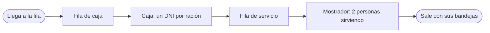
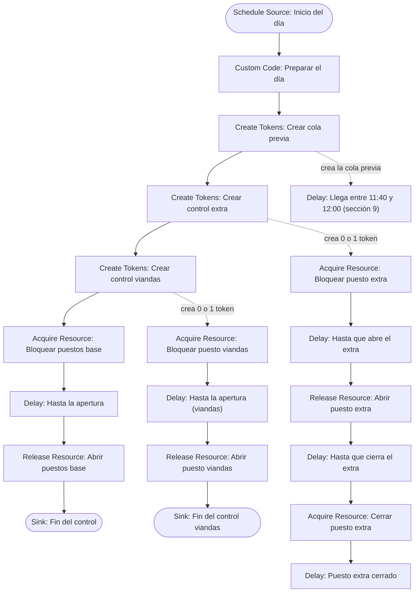
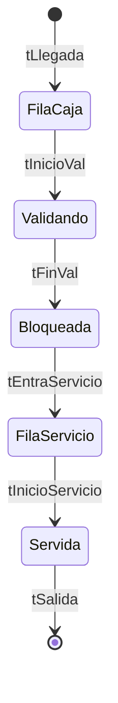
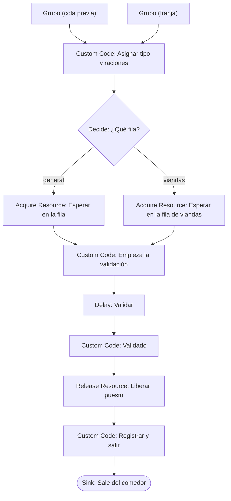
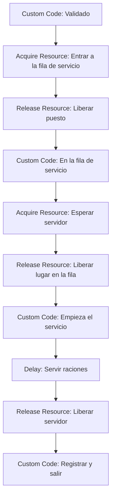

# Guía paso a paso: el modelo del comedor en FlexSim

[TOC]

Esta guía cubre la **fase 5 del [PLAN](../PLAN.md)**: armar el modelo base en FlexSim con Process Flow, con los datos de `flexsim/inputs.xlsx`. También deja preparadas las fases 6 (validación) y 7 (escenarios).

> Todo corresponde a **FlexSim 2026 (26.0.2)**, la versión de la licencia de la cátedra. Los menús y los nombres de las propiedades salen de los textos de la interfaz que trae la instalación, y se corrigieron con lo que se vio en pantalla al armar el modelo. Las funciones de FlexScript (`lognormal2`, `exponential`, `duniform`, `Table`, `Model.parameters`, `addRow`, `setSize`) salen de su ayuda offline. **Dejá FlexSim en inglés:** la traducción al español está incompleta y la guía usa los nombres en inglés.

> **Alcance (D02, revisada):** el sistema va desde la llegada a la fila hasta que la persona retira su bandeja en el mostrador. El salón y el retiro para llevar quedan fuera. Si armaste algo con la versión anterior de esta guía (salón, líneas vegetariana y no vegetariana), la sección 20 dice qué cambiar.

---

## 1. Qué vamos a construir

Cada persona es un **token**. Llega con una o más raciones: presenta un DNI por ración en la caja y retira todas sus bandejas en el mostrador (S21).



El pedido de la cátedra es ver la dinámica entre las dos etapas. Si se mejora la caja (más puestos o QR), la cola puede pasar del principio al mostrador, y hay que probar si agregar gente en el servicio acelera el proceso completo.

Todo el modelo vive en **un solo General Process Flow**, con tres partes:

| Parte | Qué hace | Supuestos |
|---|---|---|
| 1 · Inicio del día y control de los puestos | Sortea la demora de apertura, mantiene la caja cerrada hasta la apertura, abre y cierra el puesto extra (E2) y el puesto de viandas (E4) | S01, S06, S25 |
| 2 · Llegadas | Crea la cola previa (11:40 a 12:00) y las llegadas por franja de 10 minutos | S03, S04, S08, S09 |
| 3 · Persona | Fila de caja, validación, fila de servicio, mostrador y salida | S05, S07, S13, S15, S21 a S24 |

### Glosario mínimo de FlexSim

| Término | Qué es en este modelo |
|---|---|
| Token | Una persona (o un token de control de los puestos) |
| Activity | Un bloque del Process Flow: Delay, Acquire Resource, Decide, etc. |
| Label | Un dato que lleva el token: `grupo`, `tipo`, `raciones`, tiempos |
| Resource (shared asset) | Algo que se toma y se libera: los puestos de la caja, el lugar en la fila de servicio y las personas que sirven |
| Global Table | Una tabla del modelo: las de `inputs.xlsx` y las de salida |
| Model Parameter | El número de escenario (1 a 12) que después varía el Experimenter |

### El día simulado

El reloj arranca a las 11:40 (`t = 0`) para que la fila se forme antes de abrir (S09). Todo el modelo usa **segundos**.

```mermaid
gantt
    title Día simulado (t = 0 a las 11.40)
    dateFormat HH:mm
    axisFormat %H:%M
    section Llegadas
    Cola previa S09               :a1, 11:40, 20m
    Llegadas por franja S08       :a2, 12:00, 160m
    section Caja
    Cerrada hasta la apertura S25 :crit, p0, 11:40, 22m
    Atención                      :p1, after p0, 158m
    E2 puesto extra               :e2, 12:00, 90m
    section Mostrador
    Servicio                      :s1, 12:02, 160m
```



| Hora | `t` (s) | Qué pasa |
|---|---|---|
| 11:40 | 0 | Arranca el modelo; empieza a llegar la cola previa |
| 12:00 | 1200 | Empiezan las franjas; la caja abre en `1200 + demora` |
| 13:30 | 6600 | E2: cierra el puesto extra |
| 14:30 | 10200 | Fin del servicio; la última franja (14:30 a 14:40) trae los check-ins tardíos reales |
| 16:00 | 15600 | Fin de la corrida |

### Construir por etapas

No armes todo de una vez. Cada etapa se prueba antes de pasar a la siguiente:

| Etapa | Qué se agrega | Cómo se prueba |
|---|---|---|
| A | Inicio del día, llegadas, fila de caja y validación | Raciones validadas por franja contra la curva real; cola de 60 a 70 personas |
| B | Fila de servicio y mostrador | Casi sin cola en el mostrador con 1 puesto; cola de unas 24 personas con 2 puestos |
| C | E4: fila de viandas y fila general | La espera de cada fila por separado |
| D | Indicadores y tablas de salida | Ley de Little; exportar el registro por persona |
| E | Escenarios y Experimenter | 12 escenarios × 30 réplicas |
| F | Animación 3D (opcional) | Que la animación acompañe a la lógica, sin cambiarla |

---

## 2. Antes de abrir FlexSim

**Paso 1.** Regenerá las tablas para asegurarte de que están al día con `supuestos.json`:

```bash
python analisis/generar_inputs_flexsim.py
```

**Paso 2.** Corré la réplica en Python: da los números que tiene que dar FlexSim si está bien armado (sección 17).

```bash
python analisis/referencia_modelo.py
```

**Paso 3.** Tené a mano la hoja `LEEME` de `inputs.xlsx`: explica el origen de cada tabla.

---

## 3. Configurar el modelo

1. **File > New Model**. Se abre la ventana **Model Units**: *Time Units* = **Seconds**, *Length Units* = **Meters** y *Model Start Time* = un día hábil cualquiera a las **11:40:00**. Así el reloj del modelo muestra la hora real. Las unidades se pueden cambiar después en **Edit > Model Settings**.
2. En la barra de simulación, hacé clic en el reloj (*Run Time*). En la ventana que se abre, poné la parada (*Stop Time*) a las **16:00** (`t = 15600`). En *Display Mode*, elegí **Both** para ver la hora y los segundos transcurridos.
3. Mientras armás el modelo, activá **Statistics > Repeat Random Streams**: cada corrida da lo mismo y es más fácil encontrar errores. El Experimenter maneja sus propios streams por réplica.
4. Guardá como `flexsim/comedor_unc.fsm`.

---

## 4. Importar las tablas de entrada

### 4.1 Crear las Global Tables

En **Toolbox > + > Global Table**, creá una tabla por hoja, **con el mismo nombre exacto** (el código las busca por nombre):

| Global Table | Filas de datos × columnas | La usa |
|---|---|---|
| `TasaLlegadas_Pico` | 16 × 8 | Inter-Arrival Source y grupo por franja |
| `TasaLlegadas_Bajo` | 16 × 8 | Ídem, perfil bajo |
| `ColaPrevia` | 8 × 5 | Grupo de la cola previa |
| `DemoraApertura` | 32 × 2 | Preparar el día |
| `MixTipos` | 14 × 10 | Tipo, sin TACC, vianda y raciones |
| `TiemposServicio` | 2 × 10 | Delays de la caja y del mostrador |
| `Escenarios` | 12 × 14 | Todo lo que depende del escenario |
| `Referencia_Validaciones` | 32 × 7 | Solo para comparar (fase 6) |

### 4.2 Importar desde Excel

1. **Toolbox > + > Connectivity > Excel Import/Export**.
2. En la pestaña **Import**, agregá una línea por tabla con el botón **+** (*Add import table*). Para las siguientes, conviene copiar la primera línea con el botón de al lado y cambiar solo la hoja, el destino y el tamaño. En cada una:

| Campo | Valor |
|---|---|
| *Excel Workbook* | La ruta completa a `flexsim/inputs.xlsx` (con el botón para buscar el archivo) |
| *Excel Sheet Name* | El nombre de la hoja, igual al de la tabla |
| *Table Data* | La Global Table de destino (se elige con el botón *sampler* o la lista) |
| *Use Column Headers* | **Tildado** |
| *Use Row Headers* | **Destildado**: si se tilda, la primera columna (`Perfil`, `Grupo`…) pasa a ser encabezado de fila y el código no la encuentra |
| *Starting Row* / *Starting Column* | **1** / **1**: la fila de encabezados; FlexSim la toma como encabezado y lee los datos desde la siguiente |
| *Total Rows* / *Total Columns* | **Filas de datos + 1** (cuenta también la fila de encabezados) y las columnas de la tabla de arriba. Por ejemplo, 17 y 8 en las tablas de llegadas, y 13 y 14 en `Escenarios` |
| *Data Distinction* | **Automatic** o **Values Only**: los números entran como números y los textos, como texto |
| *Import table on Model Reset (if Excel file has changed)* | Tildado: al regenerar `inputs.xlsx`, FlexSim lo reimporta solo en el próximo Reset |

3. **Cerrá `inputs.xlsx` en Excel** y tocá **Import Tables**. Controlá que `Escenarios` tenga 12 filas, de `E0_Pico` a `E5_Bajo`, y que las tablas de llegadas terminen en la franja `14:30`. Si falta la última fila, revisá *Total Rows*.

> Si la importación falla, puede quedar un Excel abierto en segundo plano que bloquea el archivo (aparece `~$inputs.xlsx` en la carpeta). Se cierra desde el Administrador de tareas, pestaña *Detalles*, `EXCEL.EXE` > *Finalizar árbol de procesos*.

> Cada vez que cambie un supuesto: se edita `supuestos.json`, se corre `generar_inputs_flexsim.py` y se hace Reset en FlexSim (o se vuelve a tocar **Import Tables**). **Nunca edites las tablas de entrada a mano en FlexSim.**

---

## 5. Tablas de salida

Crealas a mano, también como Global Tables. El tamaño se pone en *Quick Properties* (*Rows* y *Columns*) y los encabezados se escriben con doble clic sobre cada uno. El modelo las limpia solo al empezar cada corrida.

| Global Table | Tamaño | Columnas | Para qué |
|---|---|---|---|
| `Salida_Dia` | 1 × 5 | `Apertura_s`, `EnFilaCaja`, `ColaCajaMax`, `EnFilaServicio`, `ColaServicioMax` | Datos del día y máximos |
| `Salida_Franjas` | 16 × 1 | `Raciones` | Raciones validadas por franja, para validar contra la curva real |
| `Salida_Personas` | 1 × 11 | `Grupo`, `Tipo`, `SinTACC`, `Raciones`, `Fila`, `tLlegada`, `tInicioVal`, `tFinVal`, `tEntraServicio`, `tInicioServicio`, `tSalida` | Una fila por persona |

En `Salida_Personas`, la **fila 1 es una plantilla**: escribí `plantilla` en `Grupo`, `Tipo` y `Fila` (así esas celdas quedan como texto) y dejá ceros en el resto. El modelo agrega una fila por persona debajo y el análisis ignora la fila 1.

---

## 6. El parámetro `Escenario`

**Toolbox > + > Statistics > Model Parameter Table**. Se crea la tabla `Parameters`. Agregá un parámetro:

- **Nombre:** `Escenario`
- **Type:** **Integer**, con *Lower Bound* = 1 y *Upper Bound* = 12
- **Valor:** 1

El valor es el **número de fila** de la tabla `Escenarios`:

| `Escenario` | Fila | `Escenario` | Fila |
|---|---|---|---|
| 1 | E0_Pico · base: 1 puesto, 2 sirviendo | 7 | E0_Bajo |
| 2 | E1_Pico · 2 puestos, fila única | 8 | E1_Bajo |
| 3 | E2_Pico · 2 puestos de 12:00 a 13:30 | 9 | E2_Bajo |
| 4 | E3_Pico · 1 puesto con QR (factor 0,6) | 10 | E3_Bajo |
| 5 | E4_Pico · fila de viandas y fila general | 11 | E4_Bajo |
| 6 | E5_Pico · 2 puestos y 3 sirviendo | 12 | E5_Bajo |

En FlexScript se lee con `Model.parameters.Escenario`. Casi todo el código empieza así:

```c
Table esc = Table("Escenarios");
int e = Model.parameters.Escenario;
double factor = esc[e]["FactorValidacion"];   // cualquier columna, por nombre
```

---

## 7. Recursos compartidos

Creá el Process Flow: **Toolbox > + > Process Flow > General** y llamalo `Comedor`. Desde la biblioteca de la izquierda, arrastrá cuatro **Resource** (sección *Shared Assets*):

| Resource | Count | Qué representa | Supuesto |
|---|---|---|---|
| `PuestosValidacion` | `Table("Escenarios")[Model.parameters.Escenario]["PuestosBase"] + Table("Escenarios")[Model.parameters.Escenario]["PuestosExtra"]` | Puestos de la caja con fila general | S06 |
| `PuestoViandas` | `1` | Puesto solo para viandas; se usa únicamente en E4 | D06 |
| `EspacioFilaServicio` | `Table("Escenarios")[Model.parameters.Escenario]["CapacidadFilaServicio"]` | Lugares en la fila entre la caja y el mostrador | S23 |
| `ServicioComida` | `Table("Escenarios")[Model.parameters.Escenario]["Servidores"]` | Personas que sirven en el mostrador | S22 |

En cada uno: *Reference* = **Numeric**, **elegido con la flechita ▼ de la lista** (si se escribe a mano, el Reset da el error *Undefined variable Numeric*), *Count* como en la tabla y *Queue Strategy* = *None*, que atiende por orden de llegada. *Type* puede aparecer en gris como *Local*: no importa. El *Count* se evalúa al hacer **Reset**, así que después de cambiar el escenario hay que resetear (el Experimenter lo hace solo). **Con esto termina la sección 7.**

`CapacidadFilaServicio` vale 999 (sin límite) hasta que el referente estime cuántas personas entran entre la caja y el mostrador (S23). Con un valor real, si la fila de servicio se llena, la persona que terminó de validar no puede avanzar y **bloquea la caja**.

**Solo de referencia, no hay que hacer nada ahora: Acquire y Release en FlexSim 2026.** No son opciones del Resource sino **actividades aparte** (biblioteca > *Shared Assets* > *Acquire Resource* y *Release Resource*), que se agregan en las secciones 8, 10, 12 y 13. El *Acquire Resource* guarda lo que tomó en una label del token (*Assign To Label*), y el *Release Resource* libera lo que está en esa label (*Resource(s) Assigned To*). En toda la guía:

| Recurso | *Assign To Label* (Acquire) y *Resource(s) Assigned To* (Release) |
|---|---|
| `PuestosValidacion` y `PuestoViandas`, en los tokens de control | `token.bloqueo` |
| `PuestosValidacion` y `PuestoViandas`, en las personas | `token.puesto` |
| `EspacioFilaServicio` | `token.espacio` |
| `ServicioComida` | `token.servidor` |

En los Release, *Resource(s) to Release* = **Release All**.

**Cómo se trabaja en el Process Flow:**

- Para agregar una actividad, arrastrala desde la biblioteca. Si la soltás pegada debajo de otra, quedan en un mismo bloque y se conectan solas.
- Para conectar dos actividades sueltas, arrastrá desde el borde de la de origen hasta la de destino. **Una actividad sin flecha de entrada no recibe tokens.**
- El nombre se cambia arriba del panel *Properties*. Usá los nombres de esta guía: el código referencia algunas actividades por nombre.
- Los campos con código tienen un botón que abre el editor (ícono de pergamino). **El código de la guía va debajo de estas cuatro líneas**, que el editor trae al abrirse. Si al pegar las borraste, agregalas de nuevo; sin ellas aparece el error *Undefined variable activity* (o `token`):

```c
Object current = param(1);
treenode activity = param(2);
Token token = param(3);
treenode processFlow = ownerobject(activity);
```

- Si el código es una sola expresión (por ejemplo, un *Count* o un *Quantity*), se escribe directo en el campo, sin esas líneas.
- Los campos que apuntan a otra actividad (*Destination* de Create Tokens) se completan con el **gotero** (*sampler*), haciendo clic en la actividad de destino. Escribir el nombre a mano da *syntax error*.

---

## 8. Etapa A · Inicio del día y control de los puestos

### Idea

La caja no puede atender antes de la apertura. En vez de programar un horario, un **token de control** toma los puestos a las 11:40 y los suelta en la apertura. Las personas que llegan antes esperan en el *Acquire* como en la vida real, y la espera queda medida sin código extra.


Hay tres tokens de control, cada uno en su columna:

- **Columna 1, puestos base:** siempre.
- **Columna 2, puesto extra de E2:** lo abre a las 12:00 y a las 13:30 vuelve a pedirlo. Como el Resource atiende por orden de llegada, ese pedido queda **detrás de las personas que ya estaban en la fila**: el puesto extra cierra después de atenderlas.
- **Columna 3, puesto de viandas de E4:** lo mantiene cerrado hasta la apertura, igual que la columna 1.



### Paso a paso

**Dónde se arma.** Todo va en la misma ventana del Process Flow `Comedor`, a la derecha de los recursos. Hacé clic en el fondo de esa ventana para que la biblioteca de la izquierda muestre las actividades (*Token Creation*, *Basic*, *Shared Assets*…). Arrastrá la primera actividad y soltá cada una de las siguientes **justo debajo de la anterior**: quedan en una misma columna y se conectan solas. El nombre de cada actividad se cambia arriba del panel *Properties*. Los *Destination* que apuntan a actividades que todavía no existen se completan después, con el gotero.

Columna 1:

| Paso | Actividad | Nombre | Propiedades |
|---|---|---|---|
| 1 | Schedule Source | `Inicio del día` | Tabla *Arrivals* con una fila: *Arrival Time* 0, *Quantity* 1. *Repeat Schedule* destildado |
| 2 | Custom Code | `Preparar el día` | Código de abajo |
| 3 | Create Tokens | `Crear cola previa` | *Quantity:* `Table("Escenarios")[Model.parameters.Escenario]["ColaPrevia"]` · *Destination:* `Llega entre 11:40 y 12:00`, elegida con el gotero (la creás en la sección 9; hasta entonces, dejalo vacío) · *Create As:* Independent Tokens |
| 4 | Create Tokens | `Crear control extra` | *Quantity:* `Table("Escenarios")[Model.parameters.Escenario]["PuestosExtra"]` · *Destination:* `Bloquear puesto extra`, con el gotero · *Create As:* Independent Tokens |
| 5 | Create Tokens | `Crear control viandas` | *Quantity:* `Table("Escenarios")[Model.parameters.Escenario]["FilasPorTipo"]` · *Destination:* `Bloquear puesto viandas`, con el gotero · *Create As:* Independent Tokens |
| 6 | Acquire Resource | `Bloquear puestos base` | *Resource Reference:* `PuestosValidacion` · *Quantity:* `Table("Escenarios")[Model.parameters.Escenario]["PuestosBase"]` · *Assign To Label:* `token.bloqueo` |
| 7 | Delay | `Hasta la apertura` | *Delay Time:* `Table("Salida_Dia")[1]["Apertura_s"] - Model.time` |
| 8 | Release Resource | `Abrir puestos base` | *Resource(s) Assigned To:* `token.bloqueo` · *Resource(s) to Release:* Release All |
| 9 | Sink | `Fin del control` | — |

Columna 2, el puesto extra de E2 (sin flecha de entrada: los tokens llegan desde `Crear control extra`):

| Paso | Actividad | Nombre | Propiedades |
|---|---|---|---|
| 10 | Acquire Resource | `Bloquear puesto extra` | *Resource Reference:* `PuestosValidacion` · *Quantity:* 1 · *Assign To Label:* `token.bloqueo` |
| 11 | Delay | `Hasta que abre el extra` | *Delay Time:* `Math.max(Table("Salida_Dia")[1]["Apertura_s"], Table("Escenarios")[Model.parameters.Escenario]["ExtraDesde_s"]) - Model.time` |
| 12 | Release Resource | `Abrir puesto extra` | *Resource(s) Assigned To:* `token.bloqueo` · *Resource(s) to Release:* Release All |
| 13 | Delay | `Hasta que cierra el extra` | *Delay Time:* `Table("Escenarios")[Model.parameters.Escenario]["ExtraHasta_s"] - Model.time` |
| 14 | Acquire Resource | `Cerrar puesto extra` | *Resource Reference:* `PuestosValidacion` · *Quantity:* 1 · *Assign To Label:* `token.bloqueo` |
| 15 | Delay | `Puesto extra cerrado` | *Delay Time:* `100000` (retiene el puesto hasta el final) |

Columna 3, el puesto de viandas de E4 (sin flecha de entrada: los tokens llegan desde `Crear control viandas`):

| Paso | Actividad | Nombre | Propiedades |
|---|---|---|---|
| 16 | Acquire Resource | `Bloquear puesto viandas` | *Resource Reference:* `PuestoViandas` · *Quantity:* 1 · *Assign To Label:* `token.bloqueo` |
| 17 | Delay | `Hasta la apertura (viandas)` | *Delay Time:* `Table("Salida_Dia")[1]["Apertura_s"] - Model.time` |
| 18 | Release Resource | `Abrir puesto viandas` | *Resource(s) Assigned To:* `token.bloqueo` · *Resource(s) to Release:* Release All |
| 19 | Sink | `Fin del control viandas` | — |

> El token del paso 15 **no** va a un Sink: si el Sink tiene tildado *Deallocate Shared Assets*, libera lo que el token tiene tomado y el puesto volvería a abrirse.

Código de **Preparar el día** (paso 2), debajo de las cuatro líneas del editor:

```c
/** Preparar el día: sortea la demora de apertura (S25) y limpia las salidas */
Table demoras = Table("DemoraApertura");
int fila = duniform(1, demoras.numRows, getstream(activity));

Table dia = Table("Salida_Dia");
dia.clear();
dia[1]["Apertura_s"] = 1200 + demoras[fila]["Demora_s"];

Table("Salida_Franjas").clear();

Table personas = Table("Salida_Personas");
personas.setSize(1, personas.numCols);   // deja solo la fila 1 (plantilla)
```

El orden importa: **Preparar el día** corre en `t = 0` antes que todo lo demás, porque lo usan los controles de los puestos y el registro de salida. Por eso todo cuelga del mismo *Schedule Source*.

---

## 9. Etapa A · Llegadas

### 9.1 Cola previa (S09)

La cola previa son **65 personas en el pico y 30 en el perfil bajo**, que llegan con distribución uniforme entre las 11:40 y las 12:00. `Crear cola previa` genera todos los tokens en `t = 0` y cada uno espera un tiempo uniforme antes de ponerse en la fila: el resultado son llegadas uniformes.

| Paso | Actividad | Nombre | Propiedades |
|---|---|---|---|
| 1 | Delay | `Llega entre 11:40 y 12:00` | *Delay Time:* `uniform(0, 1200, getstream(activity))` |
| 2 | Custom Code | `Grupo (cola previa)` | Código de abajo |

```c
/** Grupo de quien llega antes de abrir, con los pesos de la tabla ColaPrevia (S09) */
Table cp = Table("ColaPrevia");
string perfil = Table("Escenarios")[Model.parameters.Escenario]["Perfil"];
double total = 0;
for (int r = 1; r <= cp.numRows; r++)
	if (cp[r]["Perfil"] == perfil)
		total += cp[r]["Personas"];

double u = uniform(0, total, getstream(activity));
double acum = 0;
for (int r = 1; r <= cp.numRows; r++) {
	if (cp[r]["Perfil"] != perfil)
		continue;
	token.grupo = cp[r]["Grupo"];
	acum += cp[r]["Personas"];
	if (u <= acum)
		break;
}
```

### 9.2 Llegadas por franja (S08)

La tabla `TasaLlegadas_<perfil>` trae cuántas **personas** llegan, en promedio, en cada franja de 10 minutos. Salen de las validaciones reales divididas por las raciones promedio por persona de cada grupo: 1,25 en Becas Nutrirse y 1,05 en el resto (S21). Es un **proceso de Poisson no homogéneo**: la tasa $\lambda(t)$ cambia cada 10 minutos.

```grafico
tipo: lineas
titulo: Personas que llegan por franja y capacidad de un puesto
unidad: personas cada 10 min

Franja, Pico, Bajo, Capacidad de 1 puesto
12:00, 28.2, 32.6, 142
12:10, 120.8, 49.0, 142
12:20, 112.3, 37.8, 142
12:30, 107.6, 38.3, 142
12:40, 106.4, 35.3, 142
12:50, 94.4, 37.1, 142
13:00, 107.8, 45.5, 142
13:10, 114.5, 51.8, 142
13:20, 107.4, 43.9, 142
13:30, 88.0, 39.0, 142
13:40, 66.5, 38.1, 142
13:50, 66.4, 33.6, 142
14:00, 63.8, 30.9, 142
14:10, 70.7, 34.5, 142
14:20, 53.5, 31.5, 142
14:30, 7.2, 4.0, 142
```

La capacidad de un puesto es de unas 159 raciones cada 10 minutos ($600 / 3{,}77$), que con 1,12 raciones por persona son unas 142 personas. En la franja 12:00 del pico se ven solo 28 llegadas porque las otras 65 ya están en la cola previa.

**Por qué no usar `exponential(0, 600 / valor)`:** falla con las franjas de valor 0 (división por cero) y al cruzar de franja arrastra la tasa de la franja anterior. El código de abajo es exacto: busca el instante $T$ de la próxima llegada tal que

$$\int_{t}^{T} \lambda(u)\,du = E, \qquad E \sim \mathrm{Exp}(1)$$

recorriendo las franjas desde el instante actual.

| Paso | Actividad | Nombre | Propiedades |
|---|---|---|---|
| 1 | Inter-Arrival Source | `Llegadas por franja` | *Arrival at time 0:* **destildado** · *Inter-Arrival Time:* código de abajo |
| 2 | Custom Code | `Grupo (franja)` | Código de abajo |

Tiempo entre llegadas (*Inter-Arrival Time*):

```c
/** Poisson no homogéneo por franja de 10 min (S08): tiempo hasta la próxima llegada */
string perfil = Table("Escenarios")[Model.parameters.Escenario]["Perfil"];
Table tasas = Table("TasaLlegadas_" + perfil);
double ahora = Model.time;
double s = Math.max(ahora, 1200);                     // las franjas empiezan a las 12:00
double pendiente = exponential(0, 1, getstream(activity));
for (int f = Math.floor((s - 1200) / 600) + 1; f <= tasas.numRows; f++) {
	double fin = tasas[f]["Fin_s"];
	double tasa = tasas[f]["Total"] / 600;           // personas por segundo en la franja f
	if (tasa * (fin - s) >= pendiente)
		return s + pendiente / tasa - ahora;
	pendiente -= tasa * (fin - s);
	s = fin;
}
return 1000000;                                        // no hay más llegadas en el día
```

Grupo de cada llegada, con la mezcla de la franja en la que llega (S04):

```c
/** Grupo de quien llega en la franja actual, con los pesos de TasaLlegadas (S04, S08) */
string perfil = Table("Escenarios")[Model.parameters.Escenario]["Perfil"];
Table tasas = Table("TasaLlegadas_" + perfil);
int f = Math.min(Math.floor((Model.time - 1200) / 600) + 1, tasas.numRows);
Array grupos = ["Estudiantes", "BecasNutrirse", "BecasPersonal", "Personal"];

double total = 0;
for (int i = 1; i <= grupos.length; i++)
	total += tasas[f][grupos[i]];

double u = uniform(0, total, getstream(activity));
double acum = 0;
for (int i = 1; i <= grupos.length; i++) {
	token.grupo = grupos[i];
	acum += tasas[f][grupos[i]];
	if (u <= acum)
		break;
}
```

Las dos ramas (`Grupo (cola previa)` y `Grupo (franja)`) se conectan a la misma actividad: `Asignar tipo y raciones`.

---

## 10. Etapa A · Fila de caja y validación

### El recorrido de una persona

Cada cambio de estado deja una marca de tiempo en una label. Con esas marcas se calculan todos los indicadores:



| Indicador | Cálculo |
|---|---|
| Espera en la fila de caja | `tInicioVal - tLlegada` |
| Espera desde la apertura | `tInicioVal - max(tLlegada, Apertura_s)` |
| Tiempo de validación | `tFinVal - tInicioVal` |
| Tiempo bloqueando la caja | `tEntraServicio - tFinVal` (0 mientras la fila de servicio no tenga límite) |
| Espera en la fila de servicio | `tInicioServicio - tEntraServicio` |
| Tiempo total en el sistema | `tSalida - tLlegada` |

### El flujo



En la etapa A, `Liberar puesto` va directo a `Registrar y salir` (sección 15). En la etapa B se intercalan la fila de servicio y el mostrador.

| Paso | Actividad | Nombre | Propiedades |
|---|---|---|---|
| 1 | Custom Code | `Asignar tipo y raciones` | Código de abajo |
| 2 | Decide | `¿Qué fila?` | En *Connectors Out*, conectores `general` y `viandas` · *Send Token To:* código de abajo |
| 3 | Acquire Resource | `Esperar en la fila` | *Resource Reference:* `PuestosValidacion` · *Quantity:* 1 · *Assign To Label:* `token.puesto` |
| 4 | Acquire Resource | `Esperar en la fila de viandas` | *Resource Reference:* `PuestoViandas` · *Quantity:* 1 · *Assign To Label:* `token.puesto` |
| 5 | Custom Code | `Empieza la validación` | Código de abajo |
| 6 | Delay | `Validar` | *Delay Time:* código de abajo |
| 7 | Custom Code | `Validado` | Código de abajo |
| 8 | Release Resource | `Liberar puesto` | *Resource(s) Assigned To:* `token.puesto` · *Resource(s) to Release:* Release All |

**Asignar tipo y raciones:**

```c
/** Tipo dentro del grupo (S04), sin TACC (S13), vianda y raciones por persona (S21) */
Table mix = Table("MixTipos");
int st = getstream(activity);
double u = uniform(0, 1, st);
double acum = 0;
int fila = 0;
for (int r = 1; r <= mix.numRows; r++) {
	if (mix[r]["Grupo"] != token.grupo)
		continue;
	fila = r;                         // si el redondeo deja u afuera, queda el último tipo del grupo
	acum += mix[r]["PropEnGrupo"];
	if (u <= acum)
		break;
}
token.tipo = mix[fila]["Tipo"];
token.sinTACC = mix[fila]["SinTACC"];
token.esVianda = mix[fila]["EsVianda"];

double v = uniform(0, 1, st);
double p1 = mix[fila]["P1Racion"];
double p2 = mix[fila]["P2Raciones"];
token.raciones = v < p1 ? 1 : (v < p1 + p2 ? 2 : 3);

token.tLlegada = Model.time;
token.tInicioVal = 0;
token.tFinVal = 0;
token.tEntraServicio = 0;
token.tInicioServicio = 0;

Table dia = Table("Salida_Dia");
dia[1]["EnFilaCaja"] = dia[1]["EnFilaCaja"] + 1;
dia[1]["ColaCajaMax"] = Math.max(dia[1]["ColaCajaMax"], dia[1]["EnFilaCaja"]);
```

**¿Qué fila?** (*Send Token To*). Solo en E4 las viandas van a su propio puesto; en el resto de los escenarios todos van a la fila general:

```c
int porTipo = Table("Escenarios")[Model.parameters.Escenario]["FilasPorTipo"];
token.fila = (porTipo && token.esVianda) ? "Viandas" : (porTipo ? "General" : "Unica");
return token.fila == "Viandas" ? "viandas" : "general";
```

Devolver el **nombre** del conector es más seguro que devolver 1 o 2, que dependen del orden en que se dibujaron. Los nombres se ponen en la columna *Name* de la tabla *Connectors Out* del Decide.

**Empieza la validación:**

```c
token.tInicioVal = Model.time;
Table dia = Table("Salida_Dia");
dia[1]["EnFilaCaja"] = dia[1]["EnFilaCaja"] - 1;
```

**Validar** (S07: una muestra por DNI, es decir, por ración; con el factor QR de S24 en E3):

```c
/** Validación: una muestra de S07 por ración × factor del escenario (S24) */
Table ts = Table("TiemposServicio");          // fila 1 = Validacion
double total = 0;
for (int i = 1; i <= token.raciones; i++)
	total += lognormal2(0, ts[1]["Scale"], ts[1]["Shape"], getstream(activity));
return total * Table("Escenarios")[Model.parameters.Escenario]["FactorValidacion"];
```

> `lognormal2(location, scale, shape)` usa `scale` = $e^{\mu}$ (la mediana) y `shape` = $\sigma$. Está confirmado en la ayuda de FlexSim 2026. Con 3,34 y 0,494, la media da 3,77 s por ración.

**Validado:**

```c
/** Suma las raciones validadas en su franja de 10 minutos, para compararlas con la curva real */
token.tFinVal = Model.time;
Table franjas = Table("Salida_Franjas");
int f = Math.floor((Model.time - 1200) / 600) + 1;
if (f >= 1 && f <= franjas.numRows)
	franjas[f][1] = franjas[f][1] + token.raciones;
```

---

## 11. Probar la etapa A

Con `Escenario = 1` (E0_Pico): **Reset** y **Run** hasta las 16:00.

### Qué mirar

**Raciones validadas por franja.** `Salida_Franjas` tiene que seguir la curva real de `Referencia_Validaciones`. Así da la réplica en Python contra los registros:

```grafico
tipo: lineas
titulo: Raciones validadas por franja, perfil pico (E0)
unidad: raciones

Franja, Registros reales, Réplica del modelo
12:00, 103.5, 95.0
12:10, 134.9, 136.0
12:20, 124.8, 125.0
12:30, 119.3, 120.9
12:40, 117.8, 116.0
12:50, 104.6, 106.2
13:00, 119.3, 118.2
13:10, 126.9, 124.6
13:20, 119.8, 121.7
13:30, 99.0, 98.6
13:40, 75.4, 72.6
13:50, 75.5, 74.0
14:00, 72.4, 73.5
14:10, 81.7, 81.1
14:20, 62.4, 61.2
14:30, 8.5, 9.9
```

La primera franja da un poco menos que la real porque la caja abre con demora (S25). Eso se ajusta en la calibración de la fase 6, con S08 y S09.

**Cola máxima.** En `Salida_Dia`, `ColaCajaMax` tiene que rondar **60 a 75 personas** (objetivo S10: 60 a 70).

**Espera de la cola previa.** En el staytime de `Esperar en la fila`, quienes llegan antes de abrir esperan en promedio unos **14 minutos** (objetivo S10: 10 a 15). La fila previa se vacía unos 5 a 8 minutos después de la apertura.

**Ley de Little.** El contenido promedio de `Esperar en la fila` durante la corrida tiene que coincidir con

$$L = \frac{N \cdot W}{T} = \frac{1373 \times 54\ \text{s}}{15600\ \text{s}} \approx 4{,}8 \text{ personas}$$

donde $N$ son las personas del día, $W$ la espera media en la fila de caja y $T$ la duración de la corrida. Si no cierra, alguna actividad está mal conectada.

### Valores de referencia de la etapa A

Media de 30 réplicas de `analisis/referencia_modelo.py`. En una sola corrida de FlexSim los valores varían, pero tienen que quedar cerca.

| Indicador | E0_Pico | E0_Bajo |
|---|---|---|
| Personas por día | 1.373 | 619 |
| Raciones por día | 1.535 | 701 |
| Cola máxima en la caja | 71 | 36 |
| Espera media de la cola previa | 14,5 min | 13,1 min |
| Espera máxima desde la apertura | 4,9 min | 2,5 min |
| Utilización de la caja | 62 % | 28 % |

---

## 12. Etapa B · Fila de servicio y mostrador

Después de validar, la persona pasa a la fila de servicio y espera que la atienda alguna de las personas que sirven (S22). Cada ración lleva su tiempo de servicio (S15).



**El orden importa.** La persona toma un lugar en la fila de servicio **antes** de liberar el puesto de la caja. Si la fila de servicio está llena, se queda en el puesto esperando, y la caja no puede atender a nadie más: ese es el **bloqueo** (S23). Mientras `CapacidadFilaServicio` valga 999, nunca pasa.

| Paso | Actividad | Nombre | Propiedades |
|---|---|---|---|
| 1 | Acquire Resource | `Entrar a la fila de servicio` | *Resource Reference:* `EspacioFilaServicio` · *Quantity:* 1 · *Assign To Label:* `token.espacio`. Va entre `Validado` y `Liberar puesto` |
| 2 | Custom Code | `En la fila de servicio` | Código de abajo. Va después de `Liberar puesto` |
| 3 | Acquire Resource | `Esperar servidor` | *Resource Reference:* `ServicioComida` · *Quantity:* 1 · *Assign To Label:* `token.servidor` |
| 4 | Release Resource | `Liberar lugar en la fila` | *Resource(s) Assigned To:* `token.espacio` · Release All |
| 5 | Custom Code | `Empieza el servicio` | Código de abajo |
| 6 | Delay | `Servir raciones` | *Delay Time:* código de abajo |
| 7 | Release Resource | `Liberar servidor` | *Resource(s) Assigned To:* `token.servidor` · Release All |

Después de `Liberar servidor` va `Registrar y salir` y el Sink.

**En la fila de servicio:**

```c
token.tEntraServicio = Model.time;
Table dia = Table("Salida_Dia");
dia[1]["EnFilaServicio"] = dia[1]["EnFilaServicio"] + 1;
dia[1]["ColaServicioMax"] = Math.max(dia[1]["ColaServicioMax"], dia[1]["EnFilaServicio"]);
```

**Empieza el servicio:**

```c
token.tInicioServicio = Model.time;
Table dia = Table("Salida_Dia");
dia[1]["EnFilaServicio"] = dia[1]["EnFilaServicio"] - 1;
```

**Servir raciones** (S15: una muestra por ración):

```c
/** Servicio en el mostrador: una muestra de S15 por ración. Fila 2 = ServicioRacion */
Table ts = Table("TiemposServicio");
double total = 0;
for (int i = 1; i <= token.raciones; i++)
	total += lognormal2(0, ts[2]["Scale"], ts[2]["Shape"], getstream(activity));
return total;
```

**Qué esperar.** Con 1 puesto (E0), el mostrador casi no tiene cola: la cola máxima en el servicio ronda 4 personas. Con 2 puestos (E1), la caja deja pasar gente más rápido de lo que el mostrador sirve en los picos, y **la cola se corre al servicio**: ronda 24 personas. Con 3 personas sirviendo (E5), baja a unas 6. Es la dinámica que pidió la cátedra.

---

## 13. Etapa C · E4, fila de viandas y fila general

La etapa A ya dejó armada la bifurcación (`¿Qué fila?` y `Esperar en la fila de viandas`) y la etapa de inicio del día ya tiene el control del puesto de viandas (columna 3). Para probar E4:

1. Poné `Escenario = 5` (E4_Pico) y hacé **Reset**.
2. Corré y controlá que `Esperar en la fila de viandas` reciba solo tokens con `esVianda = 1`, alrededor del 35 % de las personas del pico.
3. Compará la espera de cada fila con el campo `Fila` de `Salida_Personas` (`Viandas` y `General`).

La réplica da esperas desde la apertura muy chicas en las dos filas (unos 0,1 min de media), porque con 2 puestos la caja no se satura. D06 sigue abierta: la separación se justifica solo si reduce la espera de algún grupo o si ordena mejor el mostrador.

---

## 14. Tabla de escenarios

| Escenario | Puestos | Fila de caja | Personas sirviendo | Qué prueba |
|---|---|---|---|---|
| E0 | 1 | Única | 2 | Situación actual |
| E1 | 2 | Única | 2 | ¿Se corre la cola al mostrador? |
| E2 | 1 + 1 de 12:00 a 13:30 | Única | 2 | El puesto extra solo en el pico |
| E3 | 1 con QR | Única | 2 | Validación más rápida (S24) |
| E4 | 1 general + 1 de viandas | Dos filas | 2 | Caso de estudio D06 |
| E5 | 2 | Única | 3 | ¿Agregar gente en el servicio acelera el proceso completo? |

---

## 15. Etapa D · Indicadores y salidas

### Registrar y salir

Es el último Custom Code antes del Sink. Guarda una fila por persona en `Salida_Personas`:

```c
/** Una fila por persona en Salida_Personas */
token.tSalida = Model.time;
Table log = Table("Salida_Personas");
log.addRow();
int r = log.numRows;
log[r]["Grupo"] = token.grupo;
log[r]["Tipo"] = token.tipo;
log[r]["SinTACC"] = token.sinTACC;
log[r]["Raciones"] = token.raciones;
log[r]["Fila"] = token.fila;
log[r]["tLlegada"] = token.tLlegada;
log[r]["tInicioVal"] = token.tInicioVal;
log[r]["tFinVal"] = token.tFinVal;
log[r]["tEntraServicio"] = token.tEntraServicio;
log[r]["tInicioServicio"] = token.tInicioServicio;
log[r]["tSalida"] = token.tSalida;
```

### De dónde sale cada indicador del PLAN

| Indicador | Dónde se obtiene |
|---|---|
| Espera en cada fila (media, máxima, por tipo) | `Salida_Personas`: `tInicioVal - tLlegada` y `tInicioServicio - tEntraServicio` |
| Espera desde la apertura | `Salida_Personas` y `Salida_Dia.Apertura_s` |
| Cola máxima en cada fila | `Salida_Dia.ColaCajaMax` y `Salida_Dia.ColaServicioMax` |
| Tiempo total en el sistema | `Salida_Personas`: `tSalida - tLlegada` |
| Utilización de la caja | Suma de `tFinVal - tInicioVal` sobre (puestos × tiempo abierto) |
| Utilización del servicio | Suma de `tSalida - tInicioServicio` sobre (servidores × tiempo abierto) |
| Tiempo con la caja bloqueada | `Salida_Personas`: `tEntraServicio - tFinVal` |
| Raciones validadas por franja | `Salida_Franjas` |
| Raciones reservadas no retiradas | Fuera del modelo: reservas × ausentismo (S11). No depende de la cola |

### Dashboard

Para ver el modelo mientras corre:

- **Curva de validaciones en vivo:** seleccioná la Global Table `Salida_Franjas` y, en *Quick Properties*, usá el botón de fijar (*Pin Table*) → **Bar Chart** → *Pin to New Dashboard*.
- **Largo de cada fila:** en el Process Flow, abrí las estadísticas de `Esperar en la fila` con el ícono de estadísticas de su barra de título (*View this activity's statistics*). En la ventana *Statistics*, fijá al dashboard el contenido (*Content*) en su versión contra el tiempo. Hacé lo mismo con `Esperar servidor`: en E1 se ve cómo la cola pasa de la caja al mostrador.

### Exportar las salidas

Para la fase 6, se exportan las tres tablas de salida a un Excel con la misma herramienta de la sección 4:

1. **Excel Import/Export**, pestaña **Export**. Agregá una línea por tabla (`Salida_Personas`, `Salida_Franjas` y `Salida_Dia`):
  - *Excel Workbook:* la ruta completa a `flexsim/salidas.xlsx`
  - *Excel Sheet Name:* el nombre de la tabla, con *Create sheet if it doesn't exist* tildado
  - *Use Column Headers* tildado; *Starting Row* 1 y *Starting Column* 1
2. Después de una corrida completa de E0_Pico, **Export Tables**.

El script de validación de la fase 6 lee `flexsim/salidas.xlsx` e ignora la fila de plantilla de `Salida_Personas`.

---

## 16. Etapa E · Escenarios y Experimenter

### Tipo de simulación

Es una **simulación terminante**: cada réplica es un día completo que empieza con el comedor vacío a las 11:40 y termina cuando se va el último. Por eso:

- **Warmup: 0.** No hay régimen estacionario que esperar.
- **Duración de la réplica: 15600 s** (de 11:40 a 16:00).
- **Réplicas: 30 por escenario** para empezar.

Si el intervalo de confianza de un indicador queda muy ancho, la cantidad de réplicas necesaria se estima con

$$n \approx \left(\frac{t_{0,975;\,n_0-1}\; s}{h}\right)^2$$

donde $s$ es el desvío entre réplicas de la corrida piloto de $n_0$ réplicas y $h$ el semiancho que se quiere.

### Performance Measures

**Toolbox > + > Statistics > Performance Measure Table**. Agregá una medida por indicador, con un nombre claro (por ejemplo, `TiempoTotal_min`). En cada una, dejá *Reference* en *None* y pegá el código en *Value*: corre al final de cada réplica y devuelve un número.

**Tiempo total medio en el sistema (min):**

```c
Table log = Table("Salida_Personas");
double suma = 0;
for (int r = 2; r <= log.numRows; r++)
	suma += log[r]["tSalida"] - log[r]["tLlegada"];
return suma / Math.max(log.numRows - 1, 1) / 60;
```

**Espera máxima en la caja desde la apertura (min):**

```c
Table log = Table("Salida_Personas");
double apertura = Table("Salida_Dia")[1]["Apertura_s"];
double maximo = 0;
for (int r = 2; r <= log.numRows; r++)
	maximo = Math.max(maximo, log[r]["tInicioVal"] - Math.max(log[r]["tLlegada"], apertura));
return maximo / 60;
```

**Espera media en la fila de servicio (min):**

```c
Table log = Table("Salida_Personas");
double suma = 0;
for (int r = 2; r <= log.numRows; r++)
	suma += log[r]["tInicioServicio"] - log[r]["tEntraServicio"];
return suma / Math.max(log.numRows - 1, 1) / 60;
```

**Tiempo total con la caja bloqueada (min):**

```c
Table log = Table("Salida_Personas");
double suma = 0;
for (int r = 2; r <= log.numRows; r++)
	suma += log[r]["tEntraServicio"] - log[r]["tFinVal"];
return suma / 60;
```

**Utilización de la caja (%):**

```c
Table log = Table("Salida_Personas");
Table esc = Table("Escenarios");
int e = Model.parameters.Escenario;
double apertura = Table("Salida_Dia")[1]["Apertura_s"];
double ocupado = 0;
double ultimo = apertura;
for (int r = 2; r <= log.numRows; r++) {
	ocupado += log[r]["tFinVal"] - log[r]["tInicioVal"];
	ultimo = Math.max(ultimo, log[r]["tFinVal"]);
}
double puestos = esc[e]["PuestosBase"] + esc[e]["PuestosExtra"] + esc[e]["FilasPorTipo"];
return 100 * ocupado / (puestos * (ultimo - apertura));
```

**Directos de las tablas:** cola máxima en la caja `Table("Salida_Dia")[1]["ColaCajaMax"]`, cola máxima en el servicio `Table("Salida_Dia")[1]["ColaServicioMax"]` y personas del día `Table("Salida_Personas").numRows - 1`.

### Configurar el Experimenter

En FlexSim 2026, el Experimenter se organiza en **trabajos** (*Jobs*):

1. **Statistics > Experimenter...**
2. Pestaña **Jobs**: botón **+** (*Add a new job*) → **Experiment**. Llamalo `Escenarios_E0_E5`.
3. En *Parameters*, incluí `Escenario`. En la tabla *Scenarios*, cargá 12 filas con `Escenario` = 1 a 12 y nombralas como la tabla (E0_Pico … E5_Bajo).
4. *Warmup Time*: **0** · *Stop Time*: **15600** (16:00) · *Replications per Scenario*: **30**.
5. Pestaña **Run**: elegí el trabajo y **Run**.
6. **View Results** abre *Performance Measure Results*. *Scenario Comparison* compara los escenarios, *Data Summary* da la media con su intervalo de confianza (elegí 95 %) y *Raw Data* muestra el valor de cada réplica, que es lo que se procesa en la fase 7.

Los resultados se guardan en un archivo de base de datos al lado del modelo (*Results Database File*). Si cambiás el modelo y querés descartar las corridas anteriores, usá *Delete Results File*.

---

## 17. Lo que anticipa la réplica en Python

`analisis/referencia_modelo.py` reproduce la misma lógica en Python (sin animación y sin bloqueo, porque la fila de servicio todavía no tiene límite). Sirve para **verificar**, es decir, para saber si FlexSim está bien armado. **No es la validación**: esa se hace en la fase 6 contra los registros reales. Media de 30 réplicas en el perfil pico:

| Escenario | Cola máx. caja | Espera máx. caja desde apertura | Cola máx. servicio | Espera máx. servicio | Utilización caja | Utilización servicio |
|---|---|---|---|---|---|---|
| E0 | 71 | 4,9 min | 4 | 0,2 min | 62 % | 44 % |
| E1 | 71 | 2,4 min | 24 | 1,1 min | 31 % | 44 % |
| E2 | 72 | 2,4 min | 24 | 1,2 min | 31 % | 44 % |
| E3 | 73 | 3,0 min | 16 | 0,8 min | 37 % | 44 % |
| E4 | 72 | 3,3 min | 16 | 0,8 min | 31 % | 45 % |
| E5 | 71 | 2,4 min | 6 | 0,2 min | 31 % | 30 % |

```grafico
tipo: barras
titulo: Cola máxima en el mostrador (réplica en Python)
unidad: personas

Escenario, Pico, Bajo
E0 base, 3.9, 2.6
E1 2 puestos, 23.8, 13.1
E2 extra hasta 13:30, 24.2, 14.2
E3 QR, 16.1, 7.3
E4 dos filas, 16.4, 11.3
E5 3 sirviendo, 6.1, 4.3
```

### Lectura preliminar (antes de calibrar)

- **Mejorar la caja corre la cola al mostrador.** Con 2 puestos, la cola del servicio pasa de unas 4 a unas 24 personas en el pico. Con 3 personas sirviendo (E5) baja a unas 6: agregar gente en el servicio sí acompaña la mejora de la caja.
- **La cola máxima de la caja casi no depende de los puestos:** la arma la gente que llega antes de abrir. Lo que cambia es cuánto tarda en vaciarse (la espera máxima desde la apertura baja de 4,9 a 2,4 minutos).
- **El tiempo total casi no cambia** en ningún escenario (menos de 1 minuto desde la apertura), porque con los datos actuales ni la caja ni el mostrador están saturados por mucho tiempo. La espera larga (unos 14 minutos) es la de quienes llegan antes de abrir.
- El resultado depende mucho de dos supuestos generados: el tiempo de servicio por ración (S15) y la cantidad de personas sirviendo (S22). Hay que confirmarlos con el referente y hacer el análisis de sensibilidad.

> Ojo: las tasas de llegada salen de las validaciones reales (S08). En las franjas en que la caja estuvo saturada, subestiman las llegadas: la calibración de la fase 6 puede cambiar estos números.

---

## 18. Etapa F · Animación 3D (opcional)

La lógica ya está completa sin 3D. La animación se agrega al final y **no tiene que cambiar ningún resultado**: antes y después de agregarla, comparar los indicadores de E0_Pico con la misma semilla.

1. **Layout:** FlexSim 2026 importa `.skp` (la instalación trae la librería de SketchUp). Arrastrá el modelo del comedor de `3d/` a la vista 3D o cargalo como *3D Shape* de un objeto visual. Si no se importa bien, exportalo a `.obj` desde SketchUp. El salón puede quedar como decorado.
2. **Personas visibles:** en el Process Flow, después de `Asignar tipo y raciones`, un **Create Object** crea un flowitem (persona) adentro (*Create In*) de un Queue 3D `FilaCajaVisual`. En cada etapa, un **Move Object** lo pasa al objeto 3D correspondiente (`CajaVisual`, `FilaServicioVisual`, `MostradorVisual`) y, antes del Sink, un **Destroy Object** lo elimina. El Create Object guarda el flowitem creado en una label del token (`token.persona`), que se usa como *Object(s)* en los Move Object y en el Destroy Object.
3. **Fila en serpentina:** dibujala con varios Queue en fila o con un Path; es solo visual.
4. **Personas que sirven:** 2 o 3 operarios quietos detrás del mostrador, según el escenario.
5. **Colores:** se puede pintar a cada persona según su grupo (por ejemplo, las viandas en otro color) para ver la mezcla de la fila y, en E4, la separación.

Si el tiempo no alcanza, alcanza con un layout estático y el dashboard de las dos filas: la cátedra evalúa la lógica en Process Flow y la dinámica entre la caja y el mostrador.

---

## 19. Problemas frecuentes

| Síntoma | Causa probable |
|---|---|
| *Undefined variable Numeric* al hacer Reset | *Numeric* se escribió a mano en *Reference*; hay que elegirlo de la lista |
| *Undefined variable activity* (o `token`) | Se borraron las cuatro líneas del principio del editor de código (sección 7) |
| *syntax error* en *Destination* | El destino se escribió a mano; hay que elegirlo con el gotero |
| Excepción *invalid column* o *table not found* | El nombre de la tabla o de la columna no coincide exacto (mayúsculas, guion bajo). Compararlo con `inputs.xlsx` |
| Una tabla importada trae los datos corridos o le falta la última fila | *Starting Row* y *Starting Column* tienen que estar en 1, *Total Rows* = filas de datos + 1 y *Use Row Headers* destildado |
| No se puede importar y aparece `~$inputs.xlsx` | Quedó un Excel abierto en segundo plano; se cierra desde el Administrador de tareas |
| Todo da 0 o error en la fila 0 | El parámetro `Escenario` quedó vacío o en 0 |
| Los tokens no avanzan | Falta una flecha entre dos actividades |
| La caja atiende antes de las 12:00 | `Bloquear puestos base` no está conectado al *Schedule Source*, o el *Count* de `PuestosValidacion` no se recalculó (hacer Reset) |
| En E2 el puesto extra no cierra nunca | El token de `Cerrar puesto extra` terminó en un Sink y liberó el puesto |
| No llega nadie después de las 12:00 | *Arrival at time 0* quedó tildado, o el código devuelve 1000000 desde el principio (revisar el nombre `TasaLlegadas_Pico`) |
| Llegan muchas más personas que 1.373 en el pico | El Inter-Arrival Time usa `tasas[f]["Total"]` sin dividir por 600 |
| En E4 nadie usa el puesto de viandas | Los conectores del Decide no se llaman `general` y `viandas`, o no se hizo Reset después de cambiar el escenario |
| Error al liberar un recurso, o un recurso que nunca se libera | La label de *Assign To Label* del Acquire no coincide con *Resource(s) Assigned To* del Release (sección 7) |
| `EnFilaServicio` baja de 0 | `En la fila de servicio` y `Empieza el servicio` están en otro orden |
| `Salida_Personas` crece de una corrida a otra | `Preparar el día` no está conectado al *Schedule Source* |

---

## 20. Si armaste algo con la versión anterior de la guía

La versión anterior modelaba el salón y dos líneas en el mostrador (vegetariana y no vegetariana). Con el alcance revisado (D02):

| Qué tenías | Qué hacer |
|---|---|
| Tablas `MixTipos`, `TiemposServicio`, `Escenarios` y las de llegadas | Regenerar `inputs.xlsx` y **reimportar todas**: cambiaron las columnas y el tamaño (sección 4) |
| Tabla `Salon` | Borrarla |
| Recursos `LineaVegetariana`, `LineaNoVegetariana` y `Asientos` | Renombrarlos a `PuestoViandas`, `EspacioFilaServicio` y `ServicioComida`, y cambiarles el *Count* (sección 7) |
| Tablas de salida | Cambiar las columnas de `Salida_Dia`, `Salida_Franjas` y `Salida_Personas` (sección 5) |
| Actividades de la sección 8 | Siguen valiendo. Agregar `Crear control viandas` y la columna 3 |
| Parámetro `Escenario` | Sigue igual (1 a 12), pero los escenarios cambiaron (sección 14) |

---

## 21. Checklist de la fase 5

| Paso | Etapa | Referencia |
|---|---|---|
| Modelo en segundos, inicio 11:40, stop 15600 (16:00) | — | Sección 3 |
| Tablas importadas y tablas de salida creadas | — | Secciones 4 y 5 |
| Parámetro `Escenario` y 4 Resources | — | Secciones 6 y 7 |
| Inicio del día, apertura con demora, puesto extra y puesto de viandas | A | Sección 8 |
| Cola previa y llegadas por franja | A | Sección 9 |
| Labels: grupo, tipo, sin TACC, vianda, raciones | A | Sección 10 |
| Fila de caja y validación; curva por franja parecida a la real | A | Secciones 10 y 11 |
| Fila de servicio con bloqueo y mostrador | B | Sección 12 |
| E4: fila de viandas y fila general | C | Sección 13 |
| Registro por persona e indicadores | D | Sección 15 |
| Experimenter: 12 escenarios × 30 réplicas | E | Sección 16 |
| Layout 3D y personas visibles | F (opcional) | Sección 18 |

Cuando la etapa A esté andando, conviene exportar `salidas.xlsx` de E0_Pico: con eso se arma el script de comparación de la fase 6.
