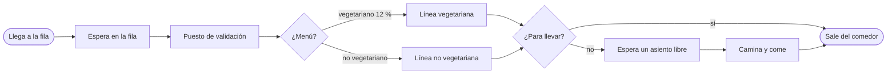
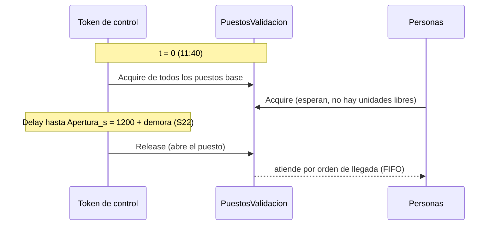
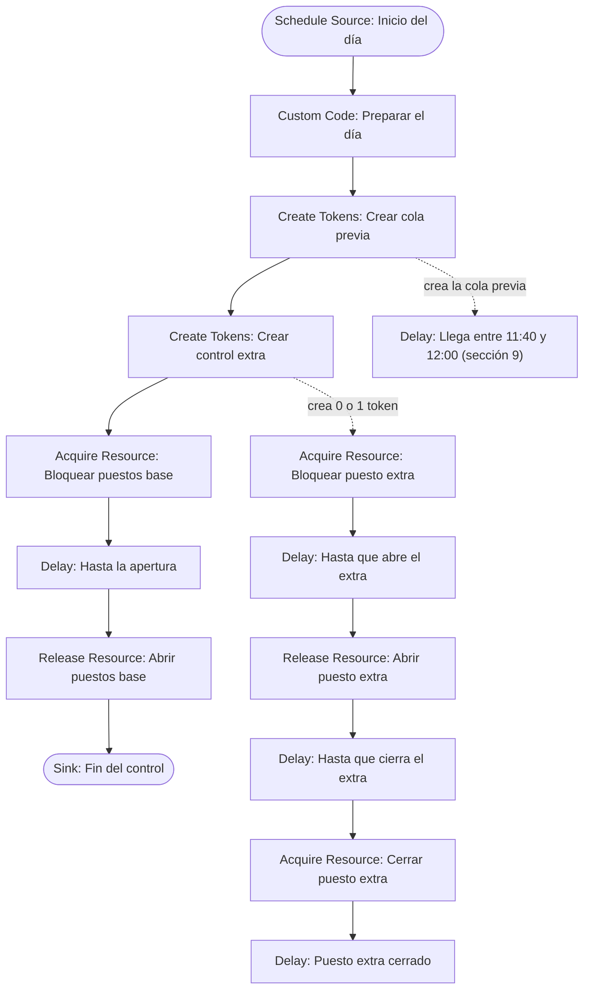
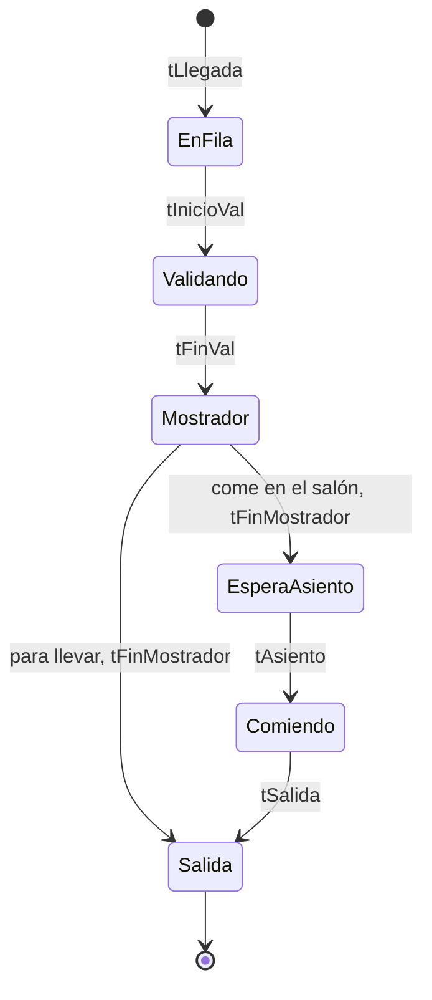
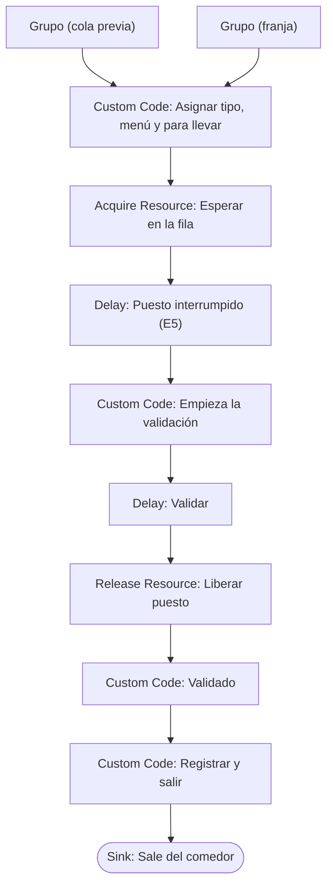
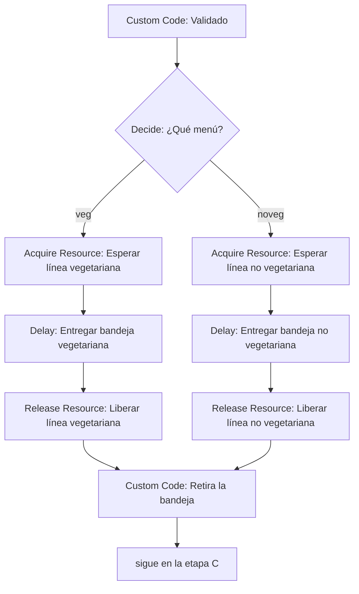
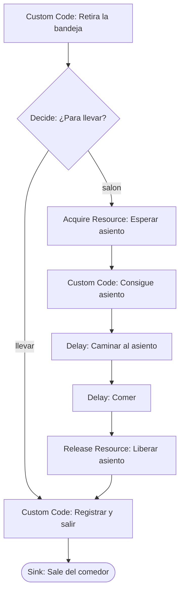

# Guía paso a paso: el modelo del comedor en FlexSim

[TOC]

Esta guía cubre la **fase 5 del [PLAN](../PLAN.md)**: armar el modelo base en FlexSim con Process Flow, con los datos de `flexsim/inputs.xlsx`. También deja preparadas las fases 6 (validación) y 7 (escenarios).

> Todo corresponde a **FlexSim 2026 (26.0.2)**, la versión de la licencia de la cátedra. Los menús y los nombres de las propiedades salen de los textos de la interfaz que trae la instalación. Las funciones de FlexScript (`lognormal2`, `exponential`, `duniform`, `Table`, `Model.parameters`, `addRow`, `setSize`) salen de su ayuda offline. **Dejá FlexSim en inglés:** la traducción al español está incompleta y la guía usa los nombres en inglés.

---

## 1. Qué vamos a construir

Cada persona es un **token** que recorre este camino:



Todo el modelo vive en **un solo General Process Flow**, con tres partes:

| Parte | Qué hace | Supuestos |
|---|---|---|
| 1 · Inicio del día y control del puesto | Sortea la demora de apertura, mantiene el puesto cerrado hasta la apertura y abre o cierra el puesto extra (E2) | S01, S06, S22 |
| 2 · Llegadas | Crea la cola previa (11:40 a 12:00) y las llegadas por franja de 10 minutos | S03, S04, S08, S09 |
| 3 · Persona | Fila, validación, mostrador, salón y salida | S05, S07, S13 a S19, S21, S23 |

### Glosario mínimo de FlexSim

| Término | Qué es en este modelo |
|---|---|
| Token | Una persona (o un token de control del puesto) |
| Activity | Un bloque del Process Flow: Delay, Acquire Resource, Decide, etc. |
| Label | Un dato que lleva el token: `grupo`, `tipo`, `vegetariano`, `paraLlevar`, tiempos |
| Resource (shared asset) | Algo que se toma y se libera: los puestos, cada línea del mostrador y los asientos |
| Global Table | Una tabla del modelo: las de `inputs.xlsx` y las de salida |
| Model Parameter | El número de escenario (1 a 12) que después varía el Experimenter |

### El día simulado

El reloj arranca a las 11:40 (`t = 0`) para que la fila se forme antes de abrir (S09). Todo el modelo usa **segundos**.

```mermaid
gantt
    title Día simulado (t = 0 a las 11.40)
    dateFormat HH:mm
    axisFormat %H:%M
    section Llegadas
    Cola previa S09               :a1, 11:40, 20m
    Llegadas por franja S08       :a2, 12:00, 160m
    section Puesto
    Cerrado hasta la apertura S22 :crit, p0, 11:40, 22m
    Atención                      :p1, after p0, 158m
    section Escenarios
    E2 puesto extra               :e2, 12:00, 90m
    E5 interrupción               :crit, e5, 12:10, 14m
    section Salón
    Consumo y salida              :s1, 12:05, 235m
```



| Hora | `t` (s) | Qué pasa |
|---|---|---|
| 11:40 | 0 | Arranca el modelo; empieza a llegar la cola previa |
| 12:00 | 1200 | Empiezan las franjas; el puesto abre en `1200 + demora` |
| 12:10 | 1800 | E5: empieza la interrupción |
| 12:24 | 2640 | E5: termina la interrupción |
| 13:30 | 6600 | E2: cierra el puesto extra |
| 14:30 | 10200 | Fin del servicio; la última franja (14:30 a 14:40) trae los check-ins tardíos reales |
| 16:00 | 15600 | Fin de la corrida: para entonces ya salió todo el mundo |

### Construir por etapas

No armes todo de una vez. Cada etapa se prueba antes de pasar a la siguiente:

| Etapa | Qué se agrega | Cómo se prueba |
|---|---|---|
| A | Inicio del día, llegadas, fila y validación | Validaciones por franja contra la curva real; cola de 60 a 70 personas |
| B | Mostrador con 2 líneas | Utilización de cada línea; casi sin cola en el mostrador |
| C | Salón con 432 asientos | Ocupación máxima, que nadie quede de pie |
| D | Indicadores y tablas de salida | Ley de Little; exportar el registro por persona |
| E | Escenarios y Experimenter | 12 escenarios × 30 réplicas |
| F | Animación 3D (opcional) | Que la animación acompañe a la lógica, sin cambiarla |

---

## 2. Antes de abrir FlexSim

**Paso 1.** Regenerá las tablas para asegurarte de que están al día con `supuestos.json`:

```bash
python analisis/generar_inputs_flexsim.py
```

**Paso 2.** Corré la réplica en Python: da los números que tiene que dar FlexSim si está bien armado (sección 16).

```bash
python analisis/referencia_modelo.py
```

**Paso 3.** Tené a mano la hoja `LEEME` de `inputs.xlsx`: explica el origen de cada tabla.

---

## 3. Configurar el modelo

1. **File > New Model**. Se abre la ventana **Model Units**: *Time Units* = **Seconds**, *Length Units* = **Meters** y *Model Start Time* = un día hábil cualquiera a las **11:40:00** (por ejemplo, 24/08/2026 11:40). Así el reloj del modelo muestra la hora real. Las unidades se pueden cambiar después en **Edit > Model Settings**.
2. En la barra de simulación, hacé clic en el reloj (*Run Time*). En la ventana que se abre, poné la parada (*Stop Time*) a las **16:00** (`t = 15600`). En *Display Mode*, elegí **Both** para ver la hora y los segundos transcurridos.
3. Mientras armás el modelo, activá **Statistics > Repeat Random Streams**: cada corrida da lo mismo y es más fácil encontrar errores. El Experimenter maneja sus propios streams por réplica.
4. Guardá como `flexsim/comedor_unc.fsm`.

---

## 4. Importar las tablas de entrada

### 4.1 Crear las Global Tables

En **Toolbox > + > Global Table**, creá una tabla por hoja, **con el mismo nombre exacto** (el código las busca por nombre). El tamaño lo ajusta el importador; igual lo necesitás para cargar *Total Rows* y *Total Columns* en el paso siguiente:

| Global Table | Filas de datos × columnas | La usa |
|---|---|---|
| `TasaLlegadas_Pico` | 16 × 8 | Inter-Arrival Source y grupo por franja |
| `TasaLlegadas_Bajo` | 16 × 8 | Ídem, perfil bajo |
| `ColaPrevia` | 8 × 5 | Grupo de la cola previa |
| `DemoraApertura` | 32 × 2 | Preparar el día |
| `MixTipos` | 14 × 6 | Tipo, menú y para llevar |
| `TiemposServicio` | 4 × 9 | Delays de validación, mostrador y salón |
| `Escenarios` | 12 × 14 | Todo lo que depende del escenario |
| `Salon` | 7 × 4 | Velocidad de caminata |
| `Referencia_Validaciones` | 32 × 7 | Solo para comparar (fase 6) |

### 4.2 Importar desde Excel

1. **Toolbox > + > Connectivity > Excel Import/Export**.
2. En la pestaña **Import**, agregá una línea por tabla con el botón **+** (*Add import table*). En cada una:

| Campo | Valor |
|---|---|
| *Excel Workbook* | La ruta completa a `flexsim/inputs.xlsx` (con el botón para buscar el archivo) |
| *Excel Sheet Name* | El nombre de la hoja, igual al de la tabla |
| *Table Data* | La Global Table de destino (se elige con el botón *sampler* o la lista) |
| *Use Column Headers* | **Tildado** |
| *Use Row Headers* | **Destildado**: si se tilda, la primera columna (`Perfil`, `Grupo`…) pasa a ser encabezado de fila y el código no la encuentra |
| *Starting Row* | **1**: la fila de los encabezados (con *Use Column Headers* tildado, FlexSim la toma como encabezado y los datos desde la siguiente) |
| *Starting Column* | **1** |
| *Total Rows* / *Total Columns* | **Filas de datos + 1** (cuenta también la fila de encabezados) y las columnas de la tabla de arriba. Por ejemplo, 13 y 14 en `Escenarios`, y 17 y 8 en las tablas de llegadas |
| *Data Distinction* | **Automatic**: los números entran como números y los textos (`Perfil`, `Grupo`, `Tipo`), como texto |
| *Import table on Model Reset (if Excel file has changed)* | Tildado: así, al regenerar `inputs.xlsx`, FlexSim lo reimporta solo en el próximo Reset |

3. **Import Tables**. Abrí `Escenarios` y controlá que tenga 12 filas y 14 columnas, con encabezados como `PuestosBase` y `FactorValidacion`, y que la primera fila sea `E0_Pico` y la última `E5_Bajo`. En las tablas de llegadas, la última franja tiene que ser `14:30`. Si faltan datos o aparecen corridos, revisá *Starting Row* y *Starting Column* (los dos en 1).

> Cada vez que cambie un supuesto: se edita `supuestos.json`, se corre `generar_inputs_flexsim.py` y se hace Reset en FlexSim (o se vuelve a tocar **Import Tables**). La configuración de importación queda guardada en el modelo. **Nunca edites las tablas de entrada a mano en FlexSim.**

---

## 5. Tablas de salida

Crealas a mano, también como Global Tables. El tamaño se pone en *Quick Properties* (*Rows* y *Columns*) y los encabezados se escriben con doble clic sobre cada uno. El modelo las limpia solo al empezar cada corrida.

| Global Table | Tamaño | Columnas | Para qué |
|---|---|---|---|
| `Salida_Dia` | 1 × 5 | `Apertura_s`, `EnFila`, `ColaMax`, `Sentados`, `SentadosMax` | Datos del día y máximos |
| `Salida_Franjas` | 16 × 1 | `Validaciones` (nombres de fila opcionales: 12:00 … 14:30) | Curva de validaciones para validar contra la real |
| `Salida_Personas` | 1 × 11 | `Grupo`, `Tipo`, `SinTACC`, `Vegetariano`, `ParaLlevar`, `tLlegada`, `tInicioVal`, `tFinVal`, `tFinMostrador`, `tAsiento`, `tSalida` | Una fila por persona |

En `Salida_Personas`, la **fila 1 es una plantilla**: escribí `plantilla` en `Grupo` y `Tipo` (así esas celdas quedan como texto) y dejá ceros en el resto. El modelo agrega una fila por persona debajo y el análisis ignora la fila 1.

---

## 6. El parámetro `Escenario`

**Toolbox > + > Statistics > Model Parameter Table**. Se crea la tabla `Parameters`. Agregá un parámetro:

- **Nombre:** `Escenario`
- **Type:** **Integer**, con *Lower Bound* = 1 y *Upper Bound* = 12
- **Valor:** 1

El valor es el **número de fila** de la tabla `Escenarios`:

| `Escenario` | Fila | `Escenario` | Fila |
|---|---|---|---|
| 1 | E0_Pico · base, 1 puesto | 7 | E0_Bajo |
| 2 | E1_Pico · 2 puestos | 8 | E1_Bajo |
| 3 | E2_Pico · 2 puestos de 12:00 a 13:30 | 9 | E2_Bajo |
| 4 | E3_Pico · QR (factor 0,6) | 10 | E3_Bajo |
| 5 | E4_Pico · layout alternativo | 11 | E4_Bajo |
| 6 | E5_Pico · interrupción del 18/8 | 12 | E5_Bajo |

En FlexScript se lee con `Model.parameters.Escenario`. Casi todo el código empieza así:

```c
Table esc = Table("Escenarios");
int e = Model.parameters.Escenario;
double factor = esc[e]["FactorValidacion"];   // cualquier columna, por nombre
```

---

## 7. Recursos compartidos

Creá el Process Flow: **Toolbox > + > Process Flow > General** y llamalo `Comedor`. Desde la biblioteca de la izquierda, arrastrá cuatro **Resource** (sección *Shared Assets*):

| Resource | Count | Supuesto |
|---|---|---|
| `PuestosValidacion` | `Table("Escenarios")[Model.parameters.Escenario]["PuestosBase"] + Table("Escenarios")[Model.parameters.Escenario]["PuestosExtra"]` | S06 |
| `LineaVegetariana` | `1` | S15 |
| `LineaNoVegetariana` | `1` | S15 |
| `Asientos` | `Table("Escenarios")[Model.parameters.Escenario]["Asientos"]` | S16 |

En cada uno: *Reference* = **Numeric**, **elegido con la flechita ▼ de la lista** (si se escribe a mano, el Reset da el error *Undefined variable Numeric*), *Count* como en la tabla y *Queue Strategy* = *None*, que atiende por orden de llegada. *Type* puede aparecer en gris como *Local*: no importa. **Con esto termina la sección 7.** El *Count* se evalúa al hacer **Reset**, así que después de cambiar el escenario hay que resetear (el Experimenter lo hace solo).

**Para más adelante: Acquire y Release en FlexSim 2026.** No son opciones del Resource sino **actividades aparte** (biblioteca > *Shared Assets* > *Acquire Resource* y *Release Resource*), que se agregan en las secciones 8, 10, 12 y 13. El *Acquire Resource* guarda lo que tomó en una label del token (*Assign To Label*), y el *Release Resource* libera lo que está en esa label (*Resource(s) Assigned To*). En toda la guía:

| Recurso | *Assign To Label* (Acquire) y *Resource(s) Assigned To* (Release) |
|---|---|
| `PuestosValidacion`, en los tokens de control | `token.bloqueo` |
| `PuestosValidacion`, en las personas | `token.puesto` |
| `LineaVegetariana` y `LineaNoVegetariana` | `token.linea` |
| `Asientos` | `token.asiento` |

En los Release, *Resource(s) to Release* = **Release All**.

**Cómo se trabaja en el Process Flow:**

- Para agregar una actividad, arrastrala desde la biblioteca. Si la soltás pegada debajo de otra, quedan en un mismo bloque y se conectan solas.
- Para conectar dos actividades sueltas, arrastrá desde el borde de la de origen hasta la de destino.
- El nombre se cambia en *Quick Properties* (panel derecho). Usá los nombres de esta guía: el código referencia algunas actividades por nombre.
- Los campos con código tienen un botón que abre el editor (ícono de pergamino). **El código de la guía va debajo de estas cuatro líneas**, que el editor trae al abrirse. Si al pegar las borraste, agregalas de nuevo; sin ellas aparece el error *Undefined variable activity* (o `token`):

```c
Object current = param(1);
treenode activity = param(2);
Token token = param(3);
treenode processFlow = ownerobject(activity);
```

- Si el código es una sola expresión (por ejemplo, un *Count* o un *Quantity*), se escribe directo en el campo, sin esas líneas.
- Los campos que apuntan a otra actividad (*Destination* de Create Tokens) se completan con el **gotero** (*sampler*), haciendo clic en la actividad de destino. Escribir el nombre a mano da *syntax error*.

---

## 8. Etapa A · Inicio del día y control del puesto

### Idea

El puesto no puede atender antes de la apertura. En vez de programar un horario, un **token de control** toma todas las unidades de `PuestosValidacion` a las 11:40 y las suelta en la apertura. Las personas que llegan antes esperan en el *Acquire* como en la vida real, y la espera queda medida sin código extra.



El puesto extra de E2 usa un segundo token de control: lo abre a las 12:00 y a las 13:30 vuelve a pedirlo. Como el Resource atiende por orden de llegada, ese pedido queda **detrás de las personas que ya estaban en la fila**: el puesto extra cierra después de atenderlas, que es la regla razonable para el escenario.



### Paso a paso

**Dónde se arma.** Todo va en la misma ventana del Process Flow `Comedor`, a la derecha de los recursos. Hacé clic en el fondo de esa ventana para que la biblioteca de la izquierda muestre las actividades (*Token Creation*, *Basic*, *Shared Assets*…). Arrastrá la primera actividad y soltá cada una de las siguientes **justo debajo de la anterior**: quedan en una misma columna y se conectan solas. El nombre de cada actividad se cambia arriba del panel *Properties*. Los *Destination* que apuntan a actividades que todavía no existen se completan después, con el gotero (*sampler*).

| Paso | Actividad | Nombre | Propiedades |
|---|---|---|---|
| 1 | Schedule Source | `Inicio del día` | Tabla *Arrivals* con una fila: *Arrival Time* 0, *Quantity* 1. *Repeat Schedule* destildado |
| 2 | Custom Code | `Preparar el día` | Código de abajo |
| 3 | Create Tokens | `Crear cola previa` | *Quantity:* `Table("Escenarios")[Model.parameters.Escenario]["ColaPrevia"]` · *Destination:* la actividad `Llega entre 11:40 y 12:00`, elegida con el gotero (la creás en la sección 9; hasta entonces, dejalo vacío) · *Create As:* Independent Tokens |
| 4 | Create Tokens | `Crear control extra` | *Quantity:* `Table("Escenarios")[Model.parameters.Escenario]["PuestosExtra"]` · *Destination:* `Bloquear puesto extra`, elegido con el gotero · *Create As:* Independent Tokens |
| 5 | Acquire Resource | `Bloquear puestos base` | *Resource Reference:* `PuestosValidacion` · *Quantity:* `Table("Escenarios")[Model.parameters.Escenario]["PuestosBase"]` · *Assign To Label:* `token.bloqueo` |
| 6 | Delay | `Hasta la apertura` | *Delay Time:* `Table("Salida_Dia")[1]["Apertura_s"] - Model.time` |
| 7 | Release Resource | `Abrir puestos base` | *Resource(s) Assigned To:* `token.bloqueo` · *Resource(s) to Release:* Release All |
| 8 | Sink | `Fin del control` | — |

La rama del puesto extra (suelta, sin conexión de entrada: los tokens le llegan desde `Crear control extra`):

| Paso | Actividad | Nombre | Propiedades |
|---|---|---|---|
| 9 | Acquire Resource | `Bloquear puesto extra` | *Resource Reference:* `PuestosValidacion` · *Quantity:* 1 · *Assign To Label:* `token.bloqueo` |
| 10 | Delay | `Hasta que abre el extra` | *Delay Time:* `Math.max(Table("Salida_Dia")[1]["Apertura_s"], Table("Escenarios")[Model.parameters.Escenario]["ExtraDesde_s"]) - Model.time` |
| 11 | Release Resource | `Abrir puesto extra` | *Resource(s) Assigned To:* `token.bloqueo` · *Resource(s) to Release:* Release All |
| 12 | Delay | `Hasta que cierra el extra` | *Delay Time:* `Table("Escenarios")[Model.parameters.Escenario]["ExtraHasta_s"] - Model.time` |
| 13 | Acquire Resource | `Cerrar puesto extra` | *Resource Reference:* `PuestosValidacion` · *Quantity:* 1 · *Assign To Label:* `token.bloqueo` |
| 14 | Delay | `Puesto extra cerrado` | *Delay Time:* `100000` (retiene el puesto hasta el final) |

> El token del paso 14 **no** va a un Sink: si el Sink tiene tildado *Deallocate Shared Assets*, libera lo que el token tiene tomado y el puesto volvería a abrirse.

Código de **Preparar el día** (paso 2):

```c
/** Preparar el día: sortea la demora de apertura (S22) y limpia las salidas */
Table demoras = Table("DemoraApertura");
int fila = duniform(1, demoras.numRows, getstream(activity));

Table dia = Table("Salida_Dia");
dia.clear();
dia[1]["Apertura_s"] = 1200 + demoras[fila]["Demora_s"];

Table("Salida_Franjas").clear();

Table personas = Table("Salida_Personas");
personas.setSize(1, personas.numCols);   // deja solo la fila 1 (plantilla)
```

El orden importa: **Preparar el día** corre en `t = 0` antes que todo lo demás, porque lo usan el control del puesto y el registro de salida. Por eso todo cuelga del mismo *Schedule Source*.

---

## 9. Etapa A · Llegadas

### 9.1 Cola previa (S09)

La cola previa son **65 personas en el pico y 30 en el perfil bajo**, que llegan con distribución uniforme entre las 11:40 y las 12:00. `Crear cola previa` genera todos los tokens en `t = 0` y cada uno espera un tiempo uniforme antes de ponerse en la fila: el resultado son llegadas uniformes.

| Paso | Actividad | Nombre | Propiedades |
|---|---|---|---|
| 1 | Delay | `Llega entre 11:40 y 12:00` | *Delay Time:* `uniform(0, 1200, getstream(activity))` |
| 2 | Custom Code | `Grupo (cola previa)` | Código de abajo |

```c
/** Grupo de quien llega antes de abrir, con los pesos de la tabla ColaPrevia (S09) */
Table cp = Table("ColaPrevia");
string perfil = Table("Escenarios")[Model.parameters.Escenario]["Perfil"];
double total = 0;
for (int r = 1; r <= cp.numRows; r++)
	if (cp[r]["Perfil"] == perfil)
		total += cp[r]["Personas"];

double u = uniform(0, total, getstream(activity));
double acum = 0;
for (int r = 1; r <= cp.numRows; r++) {
	if (cp[r]["Perfil"] != perfil)
		continue;
	token.grupo = cp[r]["Grupo"];
	acum += cp[r]["Personas"];
	if (u <= acum)
		break;
}
```

### 9.2 Llegadas por franja (S08)

La tabla `TasaLlegadas_<perfil>` trae cuántas personas llegan, en promedio, en cada franja de 10 minutos. Es un **proceso de Poisson no homogéneo**: la tasa $\lambda(t)$ cambia cada 10 minutos.

```grafico
tipo: lineas
titulo: Llegadas por franja y capacidad de un puesto
unidad: personas cada 10 min

Franja, Pico, Bajo, Capacidad de 1 puesto
12:00, 38.5, 40.1, 159.2
12:10, 134.9, 55.2, 159.2
12:20, 124.8, 42.2, 159.2
12:30, 119.3, 42.7, 159.2
12:40, 117.8, 39.6, 159.2
12:50, 104.6, 41.6, 159.2
13:00, 119.3, 50.8, 159.2
13:10, 126.9, 57.7, 159.2
13:20, 119.8, 49.0, 159.2
13:30, 99.0, 44.2, 159.2
13:40, 75.4, 43.3, 159.2
13:50, 75.5, 38.4, 159.2
14:00, 72.4, 35.5, 159.2
14:10, 81.7, 39.9, 159.2
14:20, 62.4, 37.2, 159.2
14:30, 8.5, 4.7, 159.2
```

La capacidad de un puesto es $600 / 3{,}77 \approx 159$ validaciones cada 10 minutos (media de S07). En la franja 12:00 del pico se ven solo 38,5 llegadas porque las otras 65 ya están en la cola previa.

**Por qué no usar `exponential(0, 600 / valor)`:** falla con las franjas de valor 0 (división por cero) y al cruzar de franja arrastra la tasa de la franja anterior. El código de abajo es exacto: busca el instante $T$ de la próxima llegada tal que

$$\int_{t}^{T} \lambda(u)\,du = E, \qquad E \sim \mathrm{Exp}(1)$$

recorriendo las franjas desde el instante actual.

| Paso | Actividad | Nombre | Propiedades |
|---|---|---|---|
| 1 | Inter-Arrival Source | `Llegadas por franja` | *Arrival at time 0:* **destildado** · *Inter-Arrival Time:* código de abajo |
| 2 | Custom Code | `Grupo (franja)` | Código de abajo |

Tiempo entre llegadas (*Inter-Arrival Time*):

```c
/** Poisson no homogéneo por franja de 10 min (S08): tiempo hasta la próxima llegada */
string perfil = Table("Escenarios")[Model.parameters.Escenario]["Perfil"];
Table tasas = Table("TasaLlegadas_" + perfil);
double ahora = Model.time;
double s = Math.max(ahora, 1200);                     // las franjas empiezan a las 12:00
double pendiente = exponential(0, 1, getstream(activity));
for (int f = Math.floor((s - 1200) / 600) + 1; f <= tasas.numRows; f++) {
	double fin = tasas[f]["Fin_s"];
	double tasa = tasas[f]["Total"] / 600;           // llegadas por segundo en la franja f
	if (tasa * (fin - s) >= pendiente)
		return s + pendiente / tasa - ahora;
	pendiente -= tasa * (fin - s);
	s = fin;
}
return 1000000;                                        // no hay más llegadas en el día
```

Grupo de cada llegada, con la mezcla de la franja en la que llega (S04):

```c
/** Grupo de quien llega en la franja actual, con los pesos de TasaLlegadas (S04, S08) */
string perfil = Table("Escenarios")[Model.parameters.Escenario]["Perfil"];
Table tasas = Table("TasaLlegadas_" + perfil);
int f = Math.min(Math.floor((Model.time - 1200) / 600) + 1, tasas.numRows);
Array grupos = ["Estudiantes", "BecasNutrirse", "BecasPersonal", "Personal"];

double total = 0;
for (int i = 1; i <= grupos.length; i++)
	total += tasas[f][grupos[i]];

double u = uniform(0, total, getstream(activity));
double acum = 0;
for (int i = 1; i <= grupos.length; i++) {
	token.grupo = grupos[i];
	acum += tasas[f][grupos[i]];
	if (u <= acum)
		break;
}
```

Las dos ramas (`Grupo (cola previa)` y `Grupo (franja)`) se conectan a la misma actividad: `Asignar tipo, menú y para llevar`.

---

## 10. Etapa A · Fila y validación

### El recorrido de una persona

Cada cambio de estado deja una marca de tiempo en una label. Con esas marcas se calculan todos los indicadores:



| Indicador | Cálculo |
|---|---|
| Espera en la fila | `tInicioVal - tLlegada` |
| Espera desde la apertura | `tInicioVal - max(tLlegada, Apertura_s)` |
| Tiempo de validación | `tFinVal - tInicioVal` |
| Tiempo sin asiento (de pie) | `tAsiento - tFinMostrador` |
| Permanencia total | `tSalida - tLlegada` |

### El flujo



En la etapa A, `Validado` va directo a `Registrar y salir` (sección 14). En las etapas B y C se intercalan el mostrador y el salón.

| Paso | Actividad | Nombre | Propiedades |
|---|---|---|---|
| 1 | Custom Code | `Asignar tipo, menú y para llevar` | Código de abajo |
| 2 | Acquire Resource | `Esperar en la fila` | *Resource Reference:* `PuestosValidacion` · *Quantity:* 1 · *Assign To Label:* `token.puesto` |
| 3 | Delay | `Puesto interrumpido (E5)` | *Delay Time:* código de abajo (da 0 fuera de E5) |
| 4 | Custom Code | `Empieza la validación` | Código de abajo |
| 5 | Delay | `Validar` | *Delay Time:* código de abajo |
| 6 | Release Resource | `Liberar puesto` | *Resource(s) Assigned To:* `token.puesto` · *Resource(s) to Release:* Release All |
| 7 | Custom Code | `Validado` | Código de abajo |

**Asignar tipo, menú y para llevar:**

```c
/** Tipo dentro del grupo (S04), menú (S13), para llevar (S14) y llegada a la fila */
Table mix = Table("MixTipos");
int st = getstream(activity);
double u = uniform(0, 1, st);
double acum = 0;
int fila = 0;
for (int r = 1; r <= mix.numRows; r++) {
	if (mix[r]["Grupo"] != token.grupo)
		continue;
	fila = r;                         // si el redondeo deja u afuera, queda el último tipo del grupo
	acum += mix[r]["PropEnGrupo"];
	if (u <= acum)
		break;
}
token.tipo = mix[fila]["Tipo"];
token.sinTACC = mix[fila]["SinTACC"];
token.vegetariano = uniform(0, 1, st) < mix[fila]["PVegetariano"];
token.paraLlevar = uniform(0, 1, st) < mix[fila]["PLlevar"];

token.tLlegada = Model.time;
token.tInicioVal = 0;
token.tFinVal = 0;
token.tFinMostrador = 0;
token.tAsiento = 0;

Table dia = Table("Salida_Dia");
dia[1]["EnFila"] = dia[1]["EnFila"] + 1;
dia[1]["ColaMax"] = Math.max(dia[1]["ColaMax"], dia[1]["EnFila"]);
```

**Puesto interrumpido (E5)** (S23). Si la persona toma el puesto mientras está interrumpido, espera en el puesto hasta que vuelve. Quien ya estaba siendo atendido cuando empezó la interrupción termina normalmente:

```c
/** E5: el puesto no atiende entre InterrupcionDesde_s e InterrupcionHasta_s (S23) */
Table esc = Table("Escenarios");
int e = Model.parameters.Escenario;
double desde = esc[e]["InterrupcionDesde_s"];
double hasta = esc[e]["InterrupcionHasta_s"];
if (Model.time >= desde && Model.time < hasta)
	return hasta - Model.time;
return 0;
```

**Empieza la validación:**

```c
token.tInicioVal = Model.time;
Table dia = Table("Salida_Dia");
dia[1]["EnFila"] = dia[1]["EnFila"] - 1;
```

**Validar** (S07, con el factor QR de S21 en E3):

```c
/** Validación: lognormal2 con scale = mediana = e^mu (S07) × factor del escenario (S21) */
Table ts = Table("TiemposServicio");          // fila 1 = Validacion
return lognormal2(0, ts[1]["Scale"], ts[1]["Shape"], getstream(activity))
	* Table("Escenarios")[Model.parameters.Escenario]["FactorValidacion"];
```

> `lognormal2(location, scale, shape)` usa `scale` = $e^{\mu}$ (la mediana) y `shape` = $\sigma$. Está confirmado en la ayuda de FlexSim 2026. Con 3,34 y 0,494, la media da 3,77 s.

**Validado:**

```c
/** Cuenta la validación en su franja de 10 minutos, para compararla con la curva real */
token.tFinVal = Model.time;
Table franjas = Table("Salida_Franjas");
int f = Math.floor((Model.time - 1200) / 600) + 1;
if (f >= 1 && f <= franjas.numRows)
	franjas[f][1] = franjas[f][1] + 1;
```

---

## 11. Probar la etapa A

Con `Escenario = 1` (E0_Pico): **Reset** y **Run** hasta las 16:00.

### Qué mirar

**Validaciones por franja.** `Salida_Franjas` tiene que seguir la curva real de `Referencia_Validaciones`. Así da la réplica en Python contra los registros:

```grafico
tipo: lineas
titulo: Validaciones por franja, perfil pico (E0)
unidad: validaciones

Franja, Registros reales, Réplica del modelo
12:00, 103.5, 96.0
12:10, 134.9, 136.5
12:20, 124.8, 126.2
12:30, 119.3, 119.7
12:40, 117.8, 119.6
12:50, 104.6, 109.3
13:00, 119.3, 113.5
13:10, 126.9, 123.6
13:20, 119.8, 118.9
13:30, 99.0, 98.1
13:40, 75.4, 75.2
13:50, 75.5, 77.8
14:00, 72.4, 75.2
14:10, 81.7, 81.5
14:20, 62.4, 63.3
14:30, 8.5, 9.0
```

La primera franja da un poco menos que la real porque el puesto abre con demora (S22). Eso se ajusta en la calibración de la fase 6, con S08 y S09.

**Cola máxima.** En `Salida_Dia`, `ColaMax` tiene que rondar **60 a 75 personas** (objetivo S10: 60 a 70).

**Espera de la cola previa.** En el staytime de `Esperar en la fila`, quienes llegan antes de abrir esperan en promedio unos **14 minutos** (objetivo S10: 10 a 15). La fila previa se vacía unos 5 a 8 minutos después de la apertura.

**Ley de Little.** El contenido promedio de `Esperar en la fila` durante la corrida tiene que coincidir con

$$L = \frac{N \cdot W}{T} = \frac{1544 \times 48\ \text{s}}{15600\ \text{s}} \approx 4{,}8 \text{ personas}$$

donde $N$ son las personas del día, $W$ la espera media y $T$ la duración de la corrida. Si no cierra, alguna actividad está mal conectada.

### Valores de referencia de la etapa A

Media de 30 réplicas de `analisis/referencia_modelo.py`. En una sola corrida de FlexSim los valores varían, pero tienen que quedar cerca.

| Indicador | E0_Pico | E0_Bajo |
|---|---|---|
| Personas por día | 1.544 | 691 |
| Cola máxima | 71 | 40 |
| Espera media de la cola previa | 13,9 min | 13,3 min |
| Espera media de quienes llegan después de las 12:00 | 0,2 min | 0,1 min |
| Espera máxima desde la apertura | 4,4 min | 2,4 min |
| Utilización del puesto | 62 % | 28 % |

---

## 12. Etapa B · Mostrador

Dos líneas con un servidor cada una (S15). La línea se elige con la label `vegetariano` (S13).



**Paso 1.** Desconectá `Validado` de `Registrar y salir`.

**Paso 2.** Agregá un **Decide** `¿Qué menú?` y conectalo a las dos líneas. En sus propiedades, la tabla *Connectors Out* lista los conectores de salida: en la columna *Name*, llamalos `veg` (el que va a la línea vegetariana) y `noveg`. En *Send Token To*:

```c
return token.vegetariano ? "veg" : "noveg";
```

Devolver el **nombre** del conector es más seguro que devolver 1 o 2, que dependen del orden en que se dibujaron.

**Paso 3.** En cada rama: **Acquire Resource** (*Resource Reference* `LineaVegetariana` o `LineaNoVegetariana`, *Quantity* 1, *Assign To Label* `token.linea`) → **Delay** → **Release Resource** (*Resource(s) Assigned To* `token.linea`, Release All). *Delay Time* de la línea vegetariana (en la no vegetariana, cambiar `ts[2]` por `ts[3]`):

```c
/** Entrega de bandeja (S15). Fila 2 = MostradorVegetariano, fila 3 = MostradorNoVegetariano */
Table ts = Table("TiemposServicio");
return lognormal2(0, ts[2]["Scale"], ts[2]["Shape"], getstream(activity));
```

**Paso 4.** Las dos ramas se juntan en el Custom Code **Retira la bandeja**:

```c
token.tFinMostrador = Model.time;
```

**Paso 5.** Por ahora, conectá `Retira la bandeja` → `Registrar y salir` y probá.

**Qué esperar:** el mostrador atiende más rápido (2,7 s de media) que el puesto (3,8 s), así que casi no se forma fila. La línea no vegetariana ronda el 40 % de ocupación en el pico y la vegetariana, el 6 %. Si se forma una cola larga en el mostrador, revisá el Delay: probablemente esté leyendo la fila 4 (consumo en el salón).

---

## 13. Etapa C · Salón

Quien no se lleva la comida toma un asiento libre. Si no hay, espera de pie (S18), camina, come (S17) y libera el asiento.



| Paso | Actividad | Nombre | Propiedades |
|---|---|---|---|
| 1 | Decide | `¿Para llevar?` | En *Connectors Out*, conectores `llevar` y `salon` · *Send Token To:* `return token.paraLlevar ? "llevar" : "salon";` |
| 2 | Acquire Resource | `Esperar asiento` | *Resource Reference:* `Asientos` · *Quantity:* 1 · *Assign To Label:* `token.asiento`. Su staytime es el tiempo de pie |
| 3 | Custom Code | `Consigue asiento` | Código de abajo |
| 4 | Delay | `Caminar al asiento` | *Delay Time:* ver la nota sobre la distancia |
| 5 | Delay | `Comer` | *Delay Time:* código de abajo |
| 6 | Release Resource | `Liberar asiento` | *Resource(s) Assigned To:* `token.asiento` · *Resource(s) to Release:* Release All |

**Consigue asiento:**

```c
token.tAsiento = Model.time;
Table dia = Table("Salida_Dia");
dia[1]["Sentados"] = dia[1]["Sentados"] + 1;
dia[1]["SentadosMax"] = Math.max(dia[1]["SentadosMax"], dia[1]["Sentados"]);
```

**Comer** (S17):

```c
/** Consumo en el salón (S17). Fila 4 = ConsumoSalon, en segundos */
Table ts = Table("TiemposServicio");
return lognormal2(0, ts[4]["Scale"], ts[4]["Shape"], getstream(activity));
```

**Caminar al asiento.** Falta un dato: la **distancia media del mostrador a los asientos**. Tomala del layout de SketchUp (una muestra de sillas alcanza) y registrala como supuesto nuevo en `supuestos.json`, con origen *medición propia*, igual que S16. Mientras tanto, dejá el Delay en `0`: son segundos frente a los 21 minutos de consumo y no cambian la ocupación. Con el dato, el Delay es:

```c
return DISTANCIA_MEDIA_M / Table("Salon")[2]["Valor"];   // fila 2 = VelocidadCaminata (S19)
```

**Asiento más cercano (S18).** Con un Resource numérico, todos los asientos son iguales y no se modela cuál se elige. La versión completa usa una **List** `AsientosLibres`: una tabla `Asientos` con la distancia de cada una de las 432 sillas, un *Pull from List* con la consulta `ORDER BY distancia ASC` y la caminata como distancia sobre velocidad. **Solo vale la pena si hay tiempo o si se hace E4** (reordenamiento del layout), porque sin distancias por asiento E4 da igual que E0. La réplica indica que el salón no se llena: el máximo ronda 170 a 200 asientos ocupados de 432.

---

## 14. Etapa D · Indicadores y salidas

### Registrar y salir

Es el último Custom Code antes del Sink. Guarda una fila por persona en `Salida_Personas`:

```c
/** Una fila por persona en Salida_Personas; libera el contador del salón */
token.tSalida = Model.time;
if (!token.paraLlevar && token.tAsiento > 0) {
	Table dia = Table("Salida_Dia");
	dia[1]["Sentados"] = dia[1]["Sentados"] - 1;
}

Table log = Table("Salida_Personas");
log.addRow();
int r = log.numRows;
log[r]["Grupo"] = token.grupo;
log[r]["Tipo"] = token.tipo;
log[r]["SinTACC"] = token.sinTACC;
log[r]["Vegetariano"] = token.vegetariano;
log[r]["ParaLlevar"] = token.paraLlevar;
log[r]["tLlegada"] = token.tLlegada;
log[r]["tInicioVal"] = token.tInicioVal;
log[r]["tFinVal"] = token.tFinVal;
log[r]["tFinMostrador"] = token.tFinMostrador;
log[r]["tAsiento"] = token.tAsiento;
log[r]["tSalida"] = token.tSalida;
```

### De dónde sale cada indicador del PLAN

| Indicador | Dónde se obtiene |
|---|---|
| Espera en la fila (media, máxima, % que espera más de 10 min) | `Salida_Personas`: `tInicioVal - tLlegada` |
| Espera desde la apertura | `Salida_Personas` y `Salida_Dia.Apertura_s` |
| Cola máxima | `Salida_Dia.ColaMax` |
| Utilización del puesto | Suma de `tFinVal - tInicioVal` sobre (puestos × tiempo abierto) |
| Utilización del mostrador | Contenido promedio de los Delay de cada línea |
| Validaciones por franja | `Salida_Franjas` |
| Ocupación máxima del salón | `Salida_Dia.SentadosMax` |
| Tiempo sin asiento | `Salida_Personas`: `tAsiento - tFinMostrador` (solo `ParaLlevar = 0`) |
| Permanencia total | `Salida_Personas`: `tSalida - tLlegada` |
| Raciones no retiradas | Fuera del modelo: reservas × ausentismo (S11). No depende de la cola |

### Dashboard

Para ver el modelo mientras corre:

- **Curva de validaciones en vivo:** seleccioná la Global Table `Salida_Franjas` y, en *Quick Properties*, usá el botón de fijar (*Pin Table*) → **Bar Chart** → *Pin to New Dashboard*. Se ve cómo se llena cada franja durante la corrida.
- **Largo de la fila:** en el Process Flow, abrí las estadísticas de `Esperar en la fila` con el ícono de estadísticas de su barra de título (*View this activity's statistics*). En la ventana *Statistics*, fijá al dashboard el contenido (*Content*) en su versión contra el tiempo: es la longitud de la fila a lo largo del día. Lo mismo con `Comer` (personas sentadas comiendo).

### Exportar las salidas

Para la fase 6, se exportan las tres tablas de salida a un Excel con la misma herramienta de la sección 4:

1. **Excel Import/Export**, pestaña **Export**. Agregá una línea por tabla (`Salida_Personas`, `Salida_Franjas` y `Salida_Dia`):
  - *Excel Workbook:* la ruta completa a `flexsim/salidas.xlsx`
  - *Excel Sheet Name:* el nombre de la tabla, con *Create sheet if it doesn't exist* tildado
  - *Use Column Headers* tildado; *Starting Row* 1 y *Starting Column* 1
2. Después de una corrida completa de E0_Pico, **Export Tables**.

El script de validación de la fase 6 lee `flexsim/salidas.xlsx` e ignora la fila de plantilla de `Salida_Personas`.

---

## 15. Etapa E · Escenarios y Experimenter

### Tipo de simulación

Es una **simulación terminante**: cada réplica es un día completo que empieza con el comedor vacío a las 11:40 y termina cuando se va el último. Por eso:

- **Warmup: 0.** No hay régimen estacionario que esperar.
- **Duración de la réplica: 15600 s** (de 11:40 a 16:00).
- **Réplicas: 30 por escenario** para empezar.

Si el intervalo de confianza de un indicador queda muy ancho, la cantidad de réplicas necesaria se estima con

$$n \approx \left(\frac{t_{0,975;\,n_0-1}\; s}{h}\right)^2$$

donde $s$ es el desvío entre réplicas de la corrida piloto de $n_0$ réplicas y $h$ el semiancho que se quiere.

### Performance Measures

**Toolbox > + > Statistics > Performance Measure Table**. Agregá una medida por indicador, con un nombre claro (por ejemplo, `EsperaMedia_min`). En cada una, dejá *Reference* en *None* y pegá el código en *Value*: corre al final de cada réplica y devuelve un número.

**Espera media en la fila (min):**

```c
Table log = Table("Salida_Personas");
double suma = 0;
for (int r = 2; r <= log.numRows; r++)
	suma += log[r]["tInicioVal"] - log[r]["tLlegada"];
return suma / Math.max(log.numRows - 1, 1) / 60;
```

**Espera máxima desde la apertura (min):**

```c
Table log = Table("Salida_Personas");
double apertura = Table("Salida_Dia")[1]["Apertura_s"];
double maximo = 0;
for (int r = 2; r <= log.numRows; r++)
	maximo = Math.max(maximo, log[r]["tInicioVal"] - Math.max(log[r]["tLlegada"], apertura));
return maximo / 60;
```

**Porcentaje de personas que esperan más de 10 minutos:**

```c
Table log = Table("Salida_Personas");
int n = 0;
for (int r = 2; r <= log.numRows; r++)
	if (log[r]["tInicioVal"] - log[r]["tLlegada"] > 600)
		n++;
return 100.0 * n / Math.max(log.numRows - 1, 1);
```

**Utilización del puesto (%):**

```c
Table log = Table("Salida_Personas");
Table esc = Table("Escenarios");
int e = Model.parameters.Escenario;
double apertura = Table("Salida_Dia")[1]["Apertura_s"];
double ocupado = 0;
double ultimo = apertura;
for (int r = 2; r <= log.numRows; r++) {
	ocupado += log[r]["tFinVal"] - log[r]["tInicioVal"];
	ultimo = Math.max(ultimo, log[r]["tFinVal"]);
}
double puestos = esc[e]["PuestosBase"] + esc[e]["PuestosExtra"];
return 100 * ocupado / (puestos * (ultimo - apertura));
```

**Directos de las tablas:** cola máxima `Table("Salida_Dia")[1]["ColaMax"]`, asientos ocupados como máximo `Table("Salida_Dia")[1]["SentadosMax"]` y personas del día `Table("Salida_Personas").numRows - 1`.

### Configurar el Experimenter

En FlexSim 2026, el Experimenter se organiza en **trabajos** (*Jobs*):

1. **Statistics > Experimenter...**
2. Pestaña **Jobs**: botón **+** (*Add a new job*) → **Experiment**. Llamalo `Escenarios_E0_E5`.
3. En *Parameters*, incluí `Escenario`. En la tabla *Scenarios*, cargá 12 filas con `Escenario` = 1 a 12 y nombralas como la tabla (E0_Pico … E5_Bajo).
4. *Warmup Time*: **0** · *Stop Time*: **15600** (16:00) · *Replications per Scenario*: **30**.
5. Pestaña **Run**: elegí el trabajo y **Run**.
6. **View Results** abre *Performance Measure Results*. *Scenario Comparison* compara los escenarios, *Data Summary* da la media con su intervalo de confianza (elegí 95 %) y *Raw Data* muestra el valor de cada réplica, que es lo que se procesa en la fase 7.

Los resultados se guardan en un archivo de base de datos al lado del modelo (*Results Database File*). Si cambiás el modelo y querés descartar las corridas anteriores, usá *Delete Results File*.

---

## 16. Lo que anticipa la réplica en Python

`analisis/referencia_modelo.py` reproduce la misma lógica en Python (sin animación ni caminata). Sirve para **verificar**, es decir, para saber si FlexSim está bien armado. **No es la validación**: esa se hace en la fase 6 contra los registros reales. Media de 30 réplicas:

| Escenario | Cola máx. | Espera cola previa | Espera máx. desde apertura | Utilización del puesto | Asientos ocupados máx. |
|---|---|---|---|---|---|
| E0_Pico | 71 | 13,9 min | 4,4 min | 62 % | 171 |
| E1_Pico | 73 | 13,1 min | 2,2 min | 31 % | 173 |
| E2_Pico | 74 | 13,0 min | 2,3 min | 31 % | 174 |
| E3_Pico | 75 | 14,0 min | 2,8 min | 37 % | 172 |
| E5_Pico | 192 | 14,4 min | 15,0 min | 62 % | 213 |
| E0_Bajo | 40 | 13,3 min | 2,4 min | 28 % | 74 |
| E5_Bajo | 76 | 13,3 min | 14,1 min | 28 % | 82 |

E4 da igual que E0 (el layout no entra hasta tener distancias por asiento), y E1 a E3 bajo quedan todos cerca de 1,3 min de espera máxima desde la apertura.

```grafico
tipo: barras
titulo: Espera máxima desde la apertura (réplica en Python)
unidad: min

Escenario, Pico, Bajo
E0 base, 4.4, 2.4
E1 2 puestos, 2.2, 1.3
E2 extra hasta 13:30, 2.3, 1.2
E3 QR, 2.8, 1.3
E5 interrupción, 15.0, 14.1
```

### Lectura preliminar (antes de calibrar)

- **La cola máxima casi no depende de los puestos:** la arma la gente que llega antes de abrir. Con 2 puestos, la cola del mediodía es la misma y se vacía el doble de rápido.
- **La espera larga (unos 14 minutos) es esperar la apertura**, no falta de capacidad: con 1 puesto, quien llega después de las 12:00 espera en promedio menos de medio minuto.
- **El riesgo real es una interrupción**, como la del 18/8: la cola llega a unas 190 personas y la espera, a 15 minutos.
- Esto indica que para la pregunta de estudio (D05) conviene medir la **espera desde la apertura** y el **porcentaje de personas que espera más de X minutos**, no solo la cola máxima.

> Ojo: las tasas de llegada salen de las validaciones reales (S08). En las franjas en que el puesto estuvo saturado, subestiman las llegadas: la calibración de la fase 6 puede cambiar estos números.

---

## 17. Etapa F · Animación 3D (opcional)

La lógica ya está completa sin 3D. La animación se agrega al final y **no tiene que cambiar ningún resultado**: antes y después de agregarla, comparar los indicadores de E0_Pico con la misma semilla.

1. **Layout:** FlexSim 2026 importa `.skp` (la instalación trae la librería de SketchUp). Arrastrá el modelo del salón de `3d/` a la vista 3D o cargalo como *3D Shape* de un objeto visual. Si no se importa bien, exportalo a `.obj` desde SketchUp.
2. **Personas visibles:** en el Process Flow, después de `Asignar tipo, menú y para llevar`, un **Create Object** crea un flowitem (persona) adentro (*Create In*) de un Queue 3D `FilaVisual`. En cada etapa, un **Move Object** lo pasa al objeto 3D correspondiente (`PuestoVisual`, `MostradorVisual`, `SalonVisual`) y, antes del Sink, un **Destroy Object** lo elimina. El Create Object guarda el flowitem creado en una label del token (`token.persona`), que se usa como *Object(s)* en los Move Object y en el Destroy Object.
3. **Fila en serpentina:** dibujala con varios Queue en fila o con un Path; es solo visual.
4. **Colores:** se puede pintar la persona según `grupo` (por ejemplo, Becas Nutrirse en otro color) para ver la mezcla de la fila.

Si el tiempo no alcanza, alcanza con un layout estático del salón y el dashboard de la fila: la cátedra evalúa la lógica en Process Flow.

---

## 18. Problemas frecuentes

| Síntoma | Causa probable |
|---|---|
| Excepción *invalid column* o *table not found* | El nombre de la tabla o de la columna no coincide exacto (mayúsculas, guion bajo). Compararlo con `inputs.xlsx` |
| Todo da 0 o error en la fila 0 | El parámetro `Escenario` quedó vacío o en 0 |
| El puesto atiende antes de las 12:00 | `Bloquear puestos base` no está antes de las llegadas, o el *Count* de `PuestosValidacion` no se recalculó (hacer Reset) |
| En E2 el puesto extra no cierra nunca | El token de `Cerrar puesto extra` terminó en un Sink y liberó el puesto |
| No llega nadie después de las 12:00 | *Arrival at time 0* quedó tildado, o el código devuelve 1000000 desde el principio (revisar el nombre `TasaLlegadas_Pico`) |
| Llegan muchas más personas que 1.544 en el pico | El Inter-Arrival Time usa `tasas[f]["Total"]` sin dividir por 600 |
| Todos van a la misma línea del mostrador | Los conectores del Decide no se llaman `veg` y `noveg` |
| Cola larga en el mostrador | El Delay lee la fila 4 de `TiemposServicio` (consumo) en vez de la 2 o la 3 |
| `Sentados` baja de 0 | `Registrar y salir` descuenta a alguien que no se sentó: revisar la condición `token.tAsiento > 0` |
| Una tabla importada trae los datos corridos o le falta una fila | *Starting Row* y *Starting Column* del importador tienen que estar en 1 |
| Error al liberar un recurso, o un recurso que nunca se libera | La label de *Assign To Label* del Acquire no coincide con *Resource(s) Assigned To* del Release (sección 7) |
| Cada corrida da lo mismo en el Experimenter | Normal en una corrida suelta con *Repeat Random Streams*; entre réplicas del Experimenter tiene que variar |
| `Salida_Personas` crece de una corrida a otra | `Preparar el día` no está conectado al *Schedule Source* |

---

## 19. Checklist de la fase 5

| Paso | Etapa | Referencia |
|---|---|---|
| Modelo en segundos, inicio 11:40, stop 15600 (16:00) | — | Sección 3 |
| Tablas importadas y tablas de salida creadas | — | Secciones 4 y 5 |
| Parámetro `Escenario` y 4 Resources | — | Secciones 6 y 7 |
| Inicio del día, apertura con demora y puesto extra | A | Sección 8 |
| Cola previa y llegadas por franja | A | Sección 9 |
| Labels: grupo, tipo, sin TACC, menú, para llevar | A | Sección 10 |
| Fila y validación; curva por franja parecida a la real | A | Secciones 10 y 11 |
| Mostrador con 2 líneas | B | Sección 12 |
| Salón: asientos, espera de pie y consumo | C | Sección 13 |
| Registro por persona e indicadores | D | Sección 14 |
| Experimenter: 12 escenarios × 30 réplicas | E | Sección 15 |
| Layout 3D y personas visibles | F (opcional) | Sección 17 |

Cuando la etapa A esté andando, conviene exportar `salida_franjas.csv` y `salida_personas.csv` de E0_Pico: con eso se arma el script de comparación de la fase 6.
