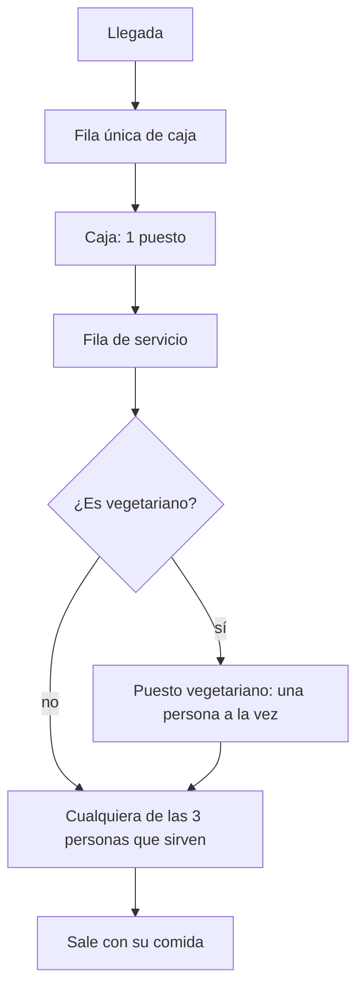
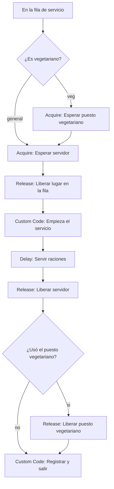

# Modificaciones al modelo: servicio con 3 personas y menú vegetariano

[TOC]

Esta guía se aplica **sobre el modelo que ya tenés armado** con `GUIA_FLEXSIM.md`. Recoge lo que contó el grupo el 10/10: cómo funciona de verdad el mostrador. Donde esta guía contradice a la otra, vale esta.

## 1. Qué cambia y por qué

| Antes | Ahora | Supuesto |
|---|---|---|
| Fila de viandas y fila general delante de la caja (E4) | **Una sola fila** para todos. Viandas y no viandas validan en el mismo puesto | S13 |
| `¿Que fila?` antes de la caja | El Decide pasa a **después de la validación** y separa vegetariano de no vegetariano | S13, S27 |
| 2 personas sirviendo (3 en E5) | **3 personas sirviendo** en el escenario base | S22 |
| Una persona atiende cualquier menú | Una de las 3 se encarga de la **comida vegetariana** (y atiende no vegetariana si está libre). Las otras dos solo sirven no vegetariana | S22 |
| Servicio de 5 s por ración | **15 a 30 s por ración** (mediana 21 s, sigma 0,21) | S15 |
| Menú: solo con o sin TACC | Hay menú vegetariano: **12 % de las personas** (generado, a confirmar) | S27 |

Las viandas (quienes traen su tupper) siguen siendo un dato del tipo de cliente, pero **ya no cambian ni la fila ni el servicio**: el modelo las trata igual que a quien recibe bandeja.



> La persona del puesto vegetariano **cuenta como una de las tres**. En el modelo, el menú vegetariano necesita el recurso `PuestoVeg` (de a uno por vez) y además una de las 3 personas. Es una simplificación: no se distingue cuál de las tres es. Hay que declararla en el informe.

## 2. Antes de aplicar: qué esperar con 21 s por ración

Con 15 a 30 s por ración y 3 personas, **el mostrador queda saturado en el pico**. La capacidad es de unas 500 raciones por hora, y la caja valida más de 900. Lo da la réplica de Python (`analisis/referencia_modelo.py`), pico, media de 30 réplicas:

| Escenario | Cola máxima en la caja | Espera media en el mostrador | Cola máxima en el mostrador | Uso del servicio |
|---|---|---|---|---|
| E0 base: 1 puesto, 3 sirviendo | 71 | 27,5 min | 325 | 98 % |
| E1: 2 puestos, 3 sirviendo | 70 | 27,3 min | 326 | 98 % |
| E2: 2 puestos 12:00 a 13:30 | 72 | 28,9 min | 338 | 98 % |
| E3: QR | 72 | 27,5 min | 325 | 98 % |
| E4: 1 puesto, 4 sirviendo | 71 | 6,7 min | 125 | 88 % |
| E5: 2 puestos, 4 sirviendo | 69 | 6,3 min | 117 | 88 % |

Lo que significa:

- **Mejorar la caja (E1, E2, E3) no cambia nada**: el cuello de botella pasó al mostrador.
- **Agregar una persona sirviendo (E4, E5) baja la espera de 27 a 7 minutos.** Es justo lo que pidió la cátedra.
- **La cola de 325 personas en el mostrador no coincide con lo observado:** el grupo y S10 ven la cola antes de la caja, no en el mostrador. Además, un mostrador de unas 500 raciones por hora no puede sostener las 900 a 1.000 que pasan por la caja en el pico: la cola crecería sin parar durante todo el servicio, y eso no se observa.

Eso apunta a que **la medición de 15 a 30 s probablemente incluye la espera en la fila del mostrador** y no solo el servicio. Así varía el resultado de E0 según el tiempo por ración (réplica, pico, 3 personas):

| Mediana por ración | Cola máx. en el mostrador | Espera media en el mostrador | Uso |
|---|---|---|---|
| 8 s | 5 | 0 min | 47 % |
| 10 s | 9 | 0 min | 58 % |
| 12 s | 23 | 0,3 min | 70 % |
| 15 s | 89 | 4,2 min | 86 % |
| 18 s | 226 | 15,9 min | 98 % |
| **21 s** | **344** | **29,2 min** | **98 %** |

Recomendación: **aplicá 21 s como pidió el grupo**, pero corré también el escenario base con 10 a 12 s como análisis de sensibilidad, y pedile al referente que cronometre solo el servicio (desde que la persona llega al mostrador hasta que recibe la comida). Mientras no se resuelva, S15 queda como «propuesto».

## 3. Paso a paso

### Paso 1. Reimportar las tablas

`inputs.xlsx` se regeneró. Los tamaños no cambiaron, así que no hay que tocar *Total Rows* ni *Total Columns*. Cerrá el Excel y tocá **Import Tables**. Controlá:

- `Escenarios`: la columna 8 ya no es `FilasPorTipo`, es **`ProbVegetariano`** (0,12). `Servidores` vale 3 en E0 a E3 y 4 en E4 y E5.
- `TiemposServicio`, fila 2 (`ServicioRacion`): `Scale` = **21** y `Shape` = **0,21**.

Si habías modificado a mano `TiemposServicio`, la reimportación pisa tus valores. Es lo que corresponde: el valor se cambia en `supuestos.json` y se regenera.

Las descripciones de los escenarios cambiaron:

| `Escenario` | Descripción |
|---|---|
| 1 y 7 | E0: 1 puesto, 3 sirviendo |
| 2 y 8 | E1: 2 puestos, 3 sirviendo |
| 3 y 9 | E2: 2 puestos de 12:00 a 13:30 |
| 4 y 10 | E3: 1 puesto con QR |
| 5 y 11 | E4: **1 puesto, 4 sirviendo** (antes: dos filas) |
| 6 y 12 | E5: 2 puestos, 4 sirviendo |

### Paso 2. Recursos

- Renombrá **`PuestoViandas`** a **`PuestoVeg`**. *Count* sigue en `1`.
- **`ServicioComida`** se queda como está: su *Count* lee `Servidores`, que ahora vale 3.

### Paso 3. Sacar todo lo de la fila de viandas

Borrá estas actividades (seleccionarlas y **Supr**):

1. La **columna 3 completa**: `Bloquear puesto viandas`, `Hasta la apertura (viandas)`, `Abrir puesto viandas` y `Fin del control viandas`.
2. `Crear control viandas` de la columna 1.
3. `Esperar en la fila de viandas`.
4. El Decide `¿Que fila?` (el que está en el bloque con `Asignar tipo y raciones`).

Después, reconectá a mano lo que quedó suelto:

- `Crear control extra` → `Bloquear puestos base`
- `Asignar tipo y raciones` → `Esperar en la fila`

Esperar en la fila ahora recibe **todas** las personas. Hacé **Reset** y verificá que no queden actividades con el signo naranja de error.

### Paso 4. Asignar el menú vegetariano

En `Asignar tipo y raciones`, **agregá estas líneas justo después de la línea** `token.raciones = v < p1 ? ...` (usan la variable `st`, que ya existe en ese código):

```c
token.esVeg = 0;
if (uniform(0, 1, st) < Table("Escenarios")[Model.parameters.Escenario]["ProbVegetariano"])
	token.esVeg = 1;
```

`token.esVianda` se sigue asignando, pero ya no se usa para decidir nada.

### Paso 5. El servicio: menú vegetariano y 3 personas

El tramo desde `En la fila de servicio` hasta `Registrar y salir` queda así:



Las actividades que **ya existen** no cambian: `Esperar servidor`, `Liberar lugar en la fila`, `Empieza el servicio`, `Servir raciones` y `Liberar servidor`. Lo que se agrega son cuatro actividades, que se conectan a mano:

| # | Actividad | Nombre | Propiedades |
|---|---|---|---|
| 1 | Decide | `¿Es vegetariano?` | Conectores `veg` y `general`. *Send Token To:* código de abajo |
| 2 | Acquire Resource | `Esperar puesto vegetariano` | *Resource Reference:* `PuestoVeg` · *Quantity:* 1 · *Assign To Label:* `token.puestoVeg` |
| 3 | Decide | `¿Usó el puesto vegetariano?` | Conectores `si` y `no`. *Send Token To:* código de abajo |
| 4 | Release Resource | `Liberar puesto vegetariano` | *Resource(s) Assigned To:* `token.puestoVeg` · *Resource(s) to Release:* Release All |

*Send Token To* de `¿Es vegetariano?`:

```c
if (token.esVeg == 1)
	return "veg";
return "general";
```

*Send Token To* de `¿Usó el puesto vegetariano?`:

```c
if (token.esVeg == 1)
	return "si";
return "no";
```

Conexiones (los *To* de los conectores se eligen con el gotero):

1. `En la fila de servicio` → `¿Es vegetariano?`
2. Conector `veg` → `Esperar puesto vegetariano`. Conector `general` → `Esperar servidor`.
3. `Esperar puesto vegetariano` → `Esperar servidor`.
4. `Liberar servidor` → `¿Usó el puesto vegetariano?`
5. Conector `si` → `Liberar puesto vegetariano`. Conector `no` → `Registrar y salir`.
6. `Liberar puesto vegetariano` → `Registrar y salir`.

Por qué hay un segundo Decide: el `Release` busca la label `token.puestoVeg` en el token. Si una persona no vegetariana llegara a ese Release, la label no existe y el modelo tira el mismo error de *Label does not exist* que ya viste con `bloqueo`. Este orden evita el problema. Y los nombres de los conectores van **en minúscula**, como lo devuelve el código.

El orden de las dos reservas evita que el modelo se trabe: el menú vegetariano toma primero `PuestoVeg` y después una persona (`ServicioComida`); nadie toma las dos en el orden contrario.

### Paso 6. Registrar y salir

La columna `Fila` de `Salida_Personas` ya no tiene sentido. Cambiala por el menú:

1. En la tabla `Salida_Personas`, renombrá el encabezado de la columna `Fila` a **`EsVeg`**. La fila `plantilla` queda con 0.
2. En `Registrar y salir`, reemplazá la línea `log[r]["Fila"] = token.fila;` por:

```c
log[r]["EsVeg"] = token.esVeg;
```

Si el código sigue leyendo `token.fila`, falla con *Label does not exist*, porque esa label ya no se asigna.

### Paso 7. Probar con Escenario = 1

**Reset** y **Run** hasta las 16:00. Con 21 s por ración y 3 personas, **tiene que verse la fila del mostrador creciendo**. Lo esperado para E0_Pico (la réplica da un orden de magnitud, no un valor exacto):

| Qué mirar | Debería dar |
|---|---|
| Personas con menú vegetariano (`EsVeg` = 1 en `Salida_Personas`) | Unas 165 de 1.370 (12 %) |
| `Salida_Dia`, `ColaCajaMax` | 60 a 75 |
| `Salida_Dia`, `ColaServicioMax` | Entre 250 y 400 |
| Espera media en el mostrador | Unos 25 a 30 minutos |
| Uso del servicio | Cerca del 98 % |
| `Salida_Franjas` | La misma curva que antes: no depende del mostrador mientras la fila de servicio no tenga límite |

Si `ColaServicioMax` da casi 0, el servicio está tomando el tiempo anterior (5 s): revisá que `TiemposServicio` se haya reimportado.

### Paso 8. Validar

Con la corrida exportada a `flexsim/salidas.xlsx`:

```bash
python analisis/validar_modelo.py --escenario E0_Pico
```

El script ya compara contra la réplica nueva, con el menú vegetariano.

## 4. Qué queda abierto

| Tema | Qué hay que resolver |
|---|---|
| S15, tiempo por ración | Pedirle al referente que cronometre solo el servicio. Si es de 10 a 12 s, el mostrador casi no tiene cola. |
| S27, 12 % vegetariano | No hay dato: lo asumimos. Estimar con el referente. |
| S23, espacio de la fila de servicio | Con 21 s, la fila del mostrador se llena. Con una capacidad real, **bloquea la caja** y cambia los resultados de E1 a E3. |
| D06, dos filas | Ya no describe el comedor. Hay que decidir con el grupo si se propone igual como mejora. E4 pasó a probar 4 personas sirviendo. |
| Cuál de las tres personas sirve vegetariano | El modelo no lo distingue (ver la nota de la sección 1). |

## 5. Resumen de actividades

**Se borran:** columna 3 completa (4 actividades), `Crear control viandas`, `Esperar en la fila de viandas`, el Decide `¿Que fila?`.

**Se agregan:** `¿Es vegetariano?`, `Esperar puesto vegetariano`, `¿Usó el puesto vegetariano?`, `Liberar puesto vegetariano`.

**Se modifican:** `Asignar tipo y raciones` (3 líneas), `Registrar y salir` (1 línea) y la tabla `Salida_Personas` (una columna).

**Recursos:** `PuestoViandas` pasa a llamarse `PuestoVeg`.
